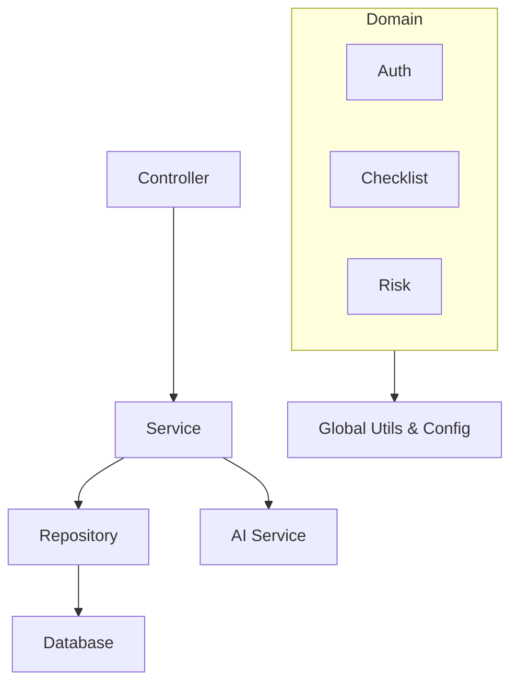

# Safety Road Backend Structure (DAG)

본 문서는 Safety Road 프로젝트의 백엔드 패키지 구조와 모듈 간의 관계를 정의합니다.
도메인 주도 설계(DDD)의 개념을 일부 차용하여 기능별로 패키지를 분리하고, 공통 기능은 `global` 패키지에서 관리합니다.

## 1. Directory Structure Overview

```text
backend/src/main/java/com/jinsung/safety_road_inclass/
├── global/                 # Cross-Cutting Concerns (공통 관심사)
│   ├── config/             # 설정 (Security, Swagger, JPA 등)
│   ├── error/              # 전역 예외 처리 (GlobalExceptionHandler)
│   └── common/             # 공통 DTO, Utils, BaseEntity
│
└── domain/                 # Business Logic (기능별 도메인)
    ├── auth/               # [REQ-FUNC-01] 인증/인가 (로그인, JWT)
    ├── template/           # [REQ-FUNC-02] 체크리스트 템플릿 관리
    ├── checklist/          # [REQ-FUNC-03] 체크리스트 작성 및 관리
    ├── review/             # [REQ-FUNC-04] 검토 및 승인 프로세스
    ├── risk/               # [REQ-FUNC-05] 위험성 평가 및 대책 수립
    ├── ai/                 # [REQ-FUNC-06] AI 분석 서비스 연동
    └── notification/       # [REQ-FUNC-07] 알림 서비스
```

## 2. Domain Layer Detail

각 도메인 패키지는 표준 Layered Architecture를 따릅니다.

### 🔒 Auth (인증/인가)
- **Path**: `domain/auth`
- **Responsibility**: 사용자 인증, JWT 토큰 발급 및 검증
- **Structure**:
  - `controller/`: 로그인, 회원가입 API
  - `service/`: 인증 로직 구현
  - `repository/`: 사용자 DB 접근
  - `entity/`: User 엔티티

### 📝 Checklist (체크리스트)
- **Path**: `domain/checklist`
- **Responsibility**: 일일 안전 점검표 작성, 저장, 조회
- **Structure**:
  - `controller/`: 체크리스트 CRUD API
  - `service/`: 작성 로직
  - `entity/`: Checklist, ChecklistItem

### ⚠️ Risk (위험성 평가)
- **Path**: `domain/risk`
- **Responsibility**: 위험 요인 식별 및 개선 대책 수립
- **Structure**:
  - `controller/`: 위험성 평가 API
  - `service/`: 평가 로직 및 점수 산정
  - `entity/`: RiskAssessment, ActionPlan

### 🤖 AI (인공지능 분석)
- **Path**: `domain/ai`
- **Responsibility**: LLM 모델 연동, 위험도 분석 요청 및 결과 처리
- **Structure**:
  - `service/`: AI 모델 클라이언트 연동 (외부 API 호출)
  - `model/`: AI 요청/응답 DTO

### 📋 Template (템플릿)
- **Path**: `domain/template`
- **Responsibility**: 표준 점검표 템플릿 관리

### 👀 Review (검토)
- **Path**: `domain/review`
- **Responsibility**: 작성된 체크리스트의 관리자 승인/반려

### 🔔 Notification (알림)
- **Path**: `domain/notification`
- **Responsibility**: 상태 변경 알림, 위험 알림 발송

## 3. Global Layer Detail

### 🌍 Global
- **Path**: `global`
- **Responsibility**: 애플리케이션 전반에서 사용되는 공통 기능
- **Modules**:
  - `config`: `SecurityConfig`, `WebMvcConfig` 등 설정 클래스
  - `error`: `GlobalExceptionHandler`, `ErrorCode` 등 에러 처리 표준
  - `common`: `ApiResponse` (공통 응답 포맷), `BaseTimeEntity` (생성/수정 시간)

## 4. Dependency Flow



