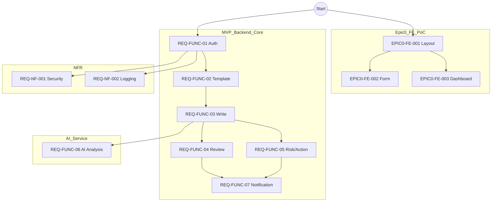

# 통합 Task Tree (WBS) 및 의존성 그래프 (DAG)

## 1. WBS (Work Breakdown Structure)

### Epic 0: FE PoC Prototype
- **Feature 0.1: Layout & Nav**
  - `EPIC0-FE-001-LAYOUT`: 전체 레이아웃 및 네비게이션
- **Feature 0.2: Checklist Form**
  - `EPIC0-FE-002-FORM`: 체크리스트 작성 폼
- **Feature 0.3: Risk Dashboard**
  - `EPIC0-FE-003-DASHBOARD`: 위험현황 대시보드

### Epic 1: Checklist Core (MVP)
- **Feature 1.1: Auth**
  - `REQ-FUNC-01-AUTH`: 인증 및 권한 관리
- **Feature 1.2: Template**
  - `REQ-FUNC-02-TEMPLATE`: 템플릿 조회
- **Feature 1.3: Write & Submit**
  - `REQ-FUNC-03-WRITE`: 작성 및 제출 (파일업로드)
- **Feature 1.4: Review**
  - `REQ-FUNC-04-REVIEW`: 감독자 승인/반려
- **Feature 1.5: Notification**
  - `REQ-FUNC-07-NOTI-TODO`: 내 할 일 조회

### Epic 2: Risk Management
- **Feature 2.1: Action**
  - `REQ-FUNC-05-RISK-ACTION`: 위험현황 및 조치
- **Feature 2.2: AI Analysis**
  - `REQ-FUNC-06-AI-ANALYSIS`: AI 사진 분석

### Non-Functional
- `REQ-NF-001-SECURITY`: 보안 아키텍처
- `REQ-NF-002-LOGGING`: 로깅 및 감사

---

## 2. DAG (Dependency Graph)

### 시각화 (Mermaid)

### 실행 순서 제언
1. **Phase 1 (PoC)**: `EPIC0-FE-001` -> `002` & `003` 병렬 진행. (UI/UX 검증)
2. **Phase 2 (Core BE)**: `F01(Auth)` 선행 -> `F02(Templ)` -> `F03(Write)` 순차 진행.
3. **Phase 3 (Review & Risk)**: `F04(Review)`와 `F05(Risk)` 병렬 진행 가능.
4. **Phase 4 (AI & Polish)**: `F06(AI)` 연동 및 `F07(Noti)` 구현. `NF` Task는 중간중간 적용.

