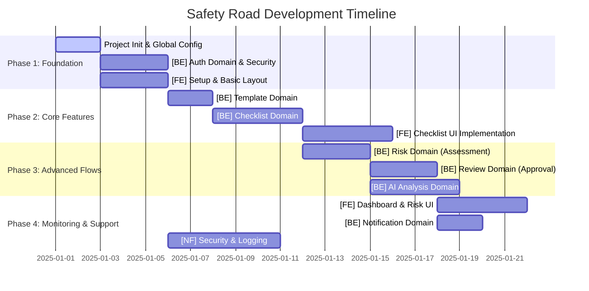

# 작업 수행 순서 및 의존성 가이드 (ISSUES)

본 문서는 Github Issues에 등록된 작업들의 권장 수행 순서와 병렬 진행 가이드를 정의합니다.
Backend의 DAG(Directed Acyclic Graph) 구조와 Frontend의 MVP 요구사항을 기반으로 작성되었습니다.

## 📌 전체 로드맵 (Overview)

---

## 📋 상세 수행 순서 (Detailed Execution Order)

### Phase 1: Foundation (기반 구축)

| Order | Issue ID | Title | Dependency | Parallelizable |
|:---:|:---:|:---|:---|:---:|
| 1 | **ISSUE-001** | **[INIT] 프로젝트 초기화 및 CI/CD 환경 구성** | - | No |
| 2 | **ISSUE-002** | **[BE] Global 패키지 및 공통 설정 구현** | ISSUE-001 | No |
| 3 | **ISSUE-003** | **[BE] Auth 도메인: 인증/인가 및 JWT 구현** | ISSUE-002 | No |
| 4 | **ISSUE-004** | **[FE] 프로젝트 셋업 및 메인 레이아웃 (PoC)** | ISSUE-001 | **Yes (with BE)** |

> **💡 Guide**: `ISSUE-004`는 백엔드 API 없이 Mock 데이터를 활용하여 레이아웃을 잡는 작업이므로 백엔드(002, 003)와 동시에 진행 가능합니다.

### Phase 2: Core Features (핵심 기능)

| Order | Issue ID | Title | Dependency | Parallelizable |
|:---:|:---:|:---|:---|:---:|
| 5 | **ISSUE-005** | **[BE] Template 도메인: 표준 점검표 관리** | ISSUE-002 | No |
| 6 | **ISSUE-006** | **[BE] Checklist 도메인: 작성 및 저장 구현** | ISSUE-005, ISSUE-003 | No |
| 7 | **ISSUE-007** | **[FE] 체크리스트 작성 폼 UI 및 연동** | ISSUE-006, ISSUE-004 | No |

> **💡 Guide**: `ISSUE-006`(체크리스트 BE)이 완료되어야 `ISSUE-007`(체크리스트 FE)의 실제 API 연동이 가능합니다.

### Phase 3: Advanced Flows (심화 로직)

| Order | Issue ID | Title | Dependency | Parallelizable |
|:---:|:---:|:---|:---|:---:|
| 8 | **ISSUE-008** | **[BE] Risk 도메인: 위험성 평가 및 대책 수립** | ISSUE-006 | **Yes (with Review)** |
| 9 | **ISSUE-009** | **[BE] Review 도메인: 검토 및 승인 프로세스** | ISSUE-006 | **Yes (with Risk)** |
| 10 | **ISSUE-010** | **[BE] AI 도메인: 위험도 분석 및 개선안 제안** | ISSUE-006, ISSUE-008 | No |

> **💡 Guide**: `Risk`와 `Review`는 모두 `Checklist` 데이터에 의존하지만, 서로 직접적인 의존성이 낮아 병렬 개발이 가능합니다. 단, `AI` 기능은 `Risk` 데이터 구조가 확정된 후 진행하는 것이 안전합니다.

### Phase 4: Monitoring & Support (모니터링 및 지원)

| Order | Issue ID | Title | Dependency | Parallelizable |
|:---:|:---:|:---|:---|:---:|
| 11 | **ISSUE-011** | **[FE] 대시보드 및 위험 현황 시각화** | ISSUE-008, ISSUE-009 | **Yes** |
| 12 | **ISSUE-012** | **[BE] Notification 도메인: 알림 서비스** | ISSUE-009 | **Yes** |
| 13 | **ISSUE-013** | **[NF] 보안 감사(Audit) 및 로깅 시스템** | ISSUE-003 | **Yes (Continuous)** |

---

## 🛠 기술 스택 및 참조 문서

- **Backend**: Java, Spring Boot 3.x, JPA, MySQL
- **Frontend**: React 18, TypeScript, Vite, TailwindCSS
- **Docs**:
  - `backend/DAG.md`: 백엔드 패키지 구조도
  - `docs/`: 요구사항 명세서 폴더

