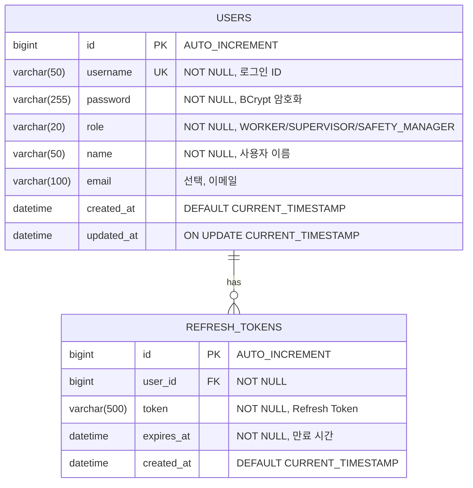
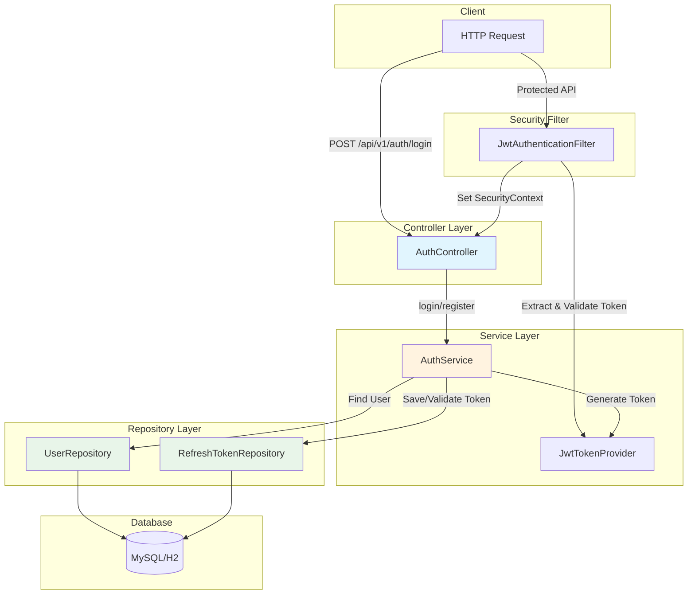

## 1. 배경 (Background)
사용자 식별 및 역할 기반 접근 제어(RBAC)를 위해 JWT 기반 인증 시스템을 구축해야 합니다.
관련 문서: `REQ-FUNC-01`, `REQ-NF-001`

---

## 2. ERD (Entity Relationship Diagram)



---

## 3. CLD (Component Logic Diagram)



### 데이터 흐름 (로그인)
```
1. [Client] POST /api/v1/auth/login (username, password)
2. [AuthController] loginRequest → AuthService.login()
3. [AuthService] UserRepository.findByUsername() → User 조회
4. [AuthService] PasswordEncoder.matches() → 비밀번호 검증
5. [JwtTokenProvider] generateAccessToken() + generateRefreshToken()
6. [AuthService] RefreshTokenRepository.save() → Refresh Token 저장
7. [AuthController] LoginResponse(accessToken, refreshToken) 반환
```

---

## 4. ORM 예제 코드

### 4.1 Entity

```java
// domain/auth/entity/User.java
@Entity
@Table(name = "users")
@Getter
@NoArgsConstructor(access = AccessLevel.PROTECTED)
public class User extends BaseTimeEntity {

    @Id
    @GeneratedValue(strategy = GenerationType.IDENTITY)
    private Long id;

    @Column(nullable = false, unique = true, length = 50)
    private String username;

    @Column(nullable = false)
    private String password;

    @Enumerated(EnumType.STRING)
    @Column(nullable = false, length = 20)
    private Role role;

    @Column(nullable = false, length = 50)
    private String name;

    @Column(length = 100)
    private String email;

    @Builder
    public User(String username, String password, Role role, String name, String email) {
        this.username = username;
        this.password = password;
        this.role = role;
        this.name = name;
        this.email = email;
    }

    // 비밀번호 암호화 (엔티티 생성 시 호출)
    public void encodePassword(PasswordEncoder encoder) {
        this.password = encoder.encode(this.password);
    }
}

// domain/auth/entity/Role.java
public enum Role {
    ROLE_WORKER,        // 작업자 (기술인)
    ROLE_SUPERVISOR,    // 관리감독자
    ROLE_SAFETY_MANAGER // 안전관리자
}
```

### 4.2 Repository

```java
// domain/auth/repository/UserRepository.java
public interface UserRepository extends JpaRepository<User, Long> {

    Optional<User> findByUsername(String username);

    boolean existsByUsername(String username);

    @Query("SELECT u FROM User u WHERE u.role = :role")
    List<User> findAllByRole(@Param("role") Role role);
}
```

### 4.3 Service

```java
// domain/auth/service/AuthService.java
@Service
@Transactional(readOnly = true)
@RequiredArgsConstructor
@Slf4j
public class AuthService {

    private final UserRepository userRepository;
    private final PasswordEncoder passwordEncoder;
    private final JwtTokenProvider jwtTokenProvider;

    @Transactional
    public LoginResponse login(LoginRequest request) {
        // 1. 사용자 조회
        User user = userRepository.findByUsername(request.getUsername())
            .orElseThrow(() -> new CustomException(ErrorCode.USER_NOT_FOUND));

        // 2. 비밀번호 검증
        if (!passwordEncoder.matches(request.getPassword(), user.getPassword())) {
            throw new CustomException(ErrorCode.INVALID_PASSWORD);
        }

        // 3. 토큰 생성
        String accessToken = jwtTokenProvider.generateAccessToken(user);
        String refreshToken = jwtTokenProvider.generateRefreshToken(user);

        log.info("로그인 성공: userId={}, username={}", user.getId(), user.getUsername());

        return LoginResponse.of(accessToken, refreshToken, user);
    }
}
```

---

## 5. 상세 작업 (Tasks)
- [x] **Domain Modeling (`domain/auth`)** ✅
    - [x] `User` Entity 설계 (username, password, role, name)
    - [x] `Role` Enum 생성 (WORKER, SUPERVISOR, SAFETY_MANAGER)
    - [x] `UserRepository` 생성
- [x] **JWT Implementation** ✅
    - [x] `JwtTokenProvider`: Access/Refresh Token 생성 및 검증 로직
    - [x] `JwtAuthenticationFilter`: 요청 헤더에서 토큰 추출 및 SecurityContext 설정
- [x] **Service Layer** ✅
    - [x] `AuthService`: 로그인(비밀번호 검증), 토큰 재발급
- [x] **API Implementation** ✅
    - [x] `POST /api/v1/auth/login`: 로그인 및 토큰 반환
    - [x] `POST /api/v1/auth/refresh`: 토큰 갱신
    - [x] `GET /api/v1/auth/me`: 내 정보 조회

## 6. 완료 조건 (Acceptance Criteria)
- [x] 유효한 ID/PW로 로그인 시 Access Token이 발급되어야 한다. ✅
- [x] 인증되지 않은 사용자가 보호된 API 접근 시 401 에러가 발생해야 한다. ✅
- [x] `ROLE_WORKER` 권한을 가진 토큰으로 관리자 API 접근 시 403 에러가 발생해야 한다. ✅

---

## 7. 테스트 계정

| Username | Password | Role | 이름 |
|:---|:---|:---|:---|
| `worker1` | `password123` | ROLE_WORKER | 김대리 |
| `worker2` | `password123` | ROLE_WORKER | 이사원 |
| `supervisor` | `password123` | ROLE_SUPERVISOR | 박소장 |
| `manager` | `password123` | ROLE_SAFETY_MANAGER | 이팀장 |

## 8. 완료일
- **2025-12-06** ✅

