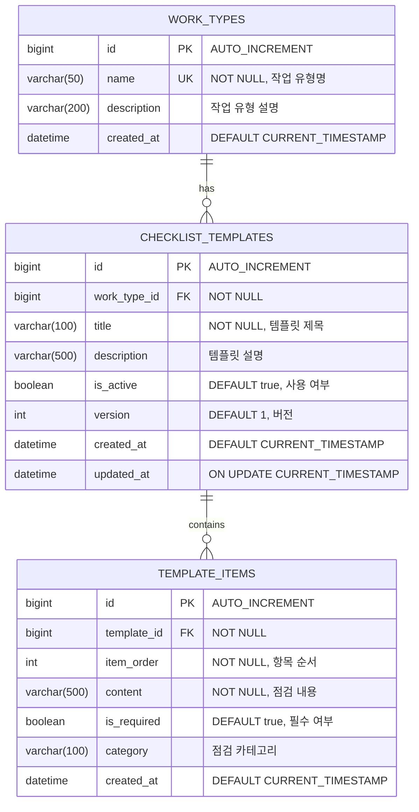

## 1. 배경 (Background)
작업자가 작성할 체크리스트의 기준이 되는 '표준 점검표 템플릿'을 관리해야 합니다.
관련 문서: `REQ-FUNC-02`

---

## 2. ERD (Entity Relationship Diagram)



### 초기 데이터 (Seed Data)
| Work Type | Template | Items Count |
|:---|:---|:---:|
| 사다리 작업 | 사다리 안전점검표 | 10개 |
| 고소작업대 작업 | 고소작업대 점검표 | 12개 |
| 밀폐공간 작업 | 밀폐공간 출입 점검표 | 15개 |

---

## 3. CLD (Component Logic Diagram)

```mermaid
flowchart TB
    subgraph Client
        A[HTTP Request]
    end

    subgraph Controller Layer
        B[TemplateController]
    end

    subgraph Service Layer
        C[TemplateService]
    end

    subgraph Repository Layer
        D[WorkTypeRepository]
        E[ChecklistTemplateRepository]
        F[TemplateItemRepository]
    end

    subgraph Database
        G[(MySQL/H2)]
    end

    subgraph Initialization
        H[DataSeeder<br/>CommandLineRunner]
    end

    A -->|GET /api/v1/templates| B
    A -->|GET /api/v1/templates/{id}| B
    B --> C
    C --> D
    C --> E
    C --> F
    D --> G
    E --> G
    F --> G
    H -->|App Start| E
    H -->|App Start| F

    style B fill:#e1f5fe
    style C fill:#fff3e0
    style D fill:#e8f5e9
    style E fill:#e8f5e9
    style F fill:#e8f5e9
```

### 데이터 흐름 (템플릿 조회)
```
1. [Client] GET /api/v1/templates?workTypeId=1
2. [TemplateController] request → TemplateService.getTemplates()
3. [TemplateService] ChecklistTemplateRepository.findByWorkTypeId()
4. [TemplateService] TemplateItemRepository.findByTemplateId() (Lazy Loading)
5. [TemplateController] List<TemplateResponse> 반환
```

---

## 4. ORM 예제 코드

### 4.1 Entity

```java
// domain/template/entity/WorkType.java
@Entity
@Table(name = "work_types")
@Getter
@NoArgsConstructor(access = AccessLevel.PROTECTED)
public class WorkType {

    @Id
    @GeneratedValue(strategy = GenerationType.IDENTITY)
    private Long id;

    @Column(nullable = false, unique = true, length = 50)
    private String name;

    @Column(length = 200)
    private String description;

    @OneToMany(mappedBy = "workType", cascade = CascadeType.ALL)
    private List<ChecklistTemplate> templates = new ArrayList<>();

    @Builder
    public WorkType(String name, String description) {
        this.name = name;
        this.description = description;
    }
}

// domain/template/entity/ChecklistTemplate.java
@Entity
@Table(name = "checklist_templates")
@Getter
@NoArgsConstructor(access = AccessLevel.PROTECTED)
public class ChecklistTemplate extends BaseTimeEntity {

    @Id
    @GeneratedValue(strategy = GenerationType.IDENTITY)
    private Long id;

    @ManyToOne(fetch = FetchType.LAZY)
    @JoinColumn(name = "work_type_id", nullable = false)
    private WorkType workType;

    @Column(nullable = false, length = 100)
    private String title;

    @Column(length = 500)
    private String description;

    @Column(nullable = false)
    private Boolean isActive = true;

    @Column(nullable = false)
    private Integer version = 1;

    @OneToMany(mappedBy = "template", cascade = CascadeType.ALL, orphanRemoval = true)
    @OrderBy("itemOrder ASC")
    private List<TemplateItem> items = new ArrayList<>();

    @Builder
    public ChecklistTemplate(WorkType workType, String title, String description) {
        this.workType = workType;
        this.title = title;
        this.description = description;
    }

    public void addItem(TemplateItem item) {
        this.items.add(item);
        item.setTemplate(this);
    }
}

// domain/template/entity/TemplateItem.java
@Entity
@Table(name = "template_items")
@Getter
@NoArgsConstructor(access = AccessLevel.PROTECTED)
public class TemplateItem {

    @Id
    @GeneratedValue(strategy = GenerationType.IDENTITY)
    private Long id;

    @ManyToOne(fetch = FetchType.LAZY)
    @JoinColumn(name = "template_id", nullable = false)
    private ChecklistTemplate template;

    @Column(nullable = false)
    private Integer itemOrder;

    @Column(nullable = false, length = 500)
    private String content;

    @Column(nullable = false)
    private Boolean isRequired = true;

    @Column(length = 100)
    private String category;

    @Builder
    public TemplateItem(Integer itemOrder, String content, Boolean isRequired, String category) {
        this.itemOrder = itemOrder;
        this.content = content;
        this.isRequired = isRequired;
        this.category = category;
    }

    void setTemplate(ChecklistTemplate template) {
        this.template = template;
    }
}
```

### 4.2 Repository

```java
// domain/template/repository/ChecklistTemplateRepository.java
public interface ChecklistTemplateRepository extends JpaRepository<ChecklistTemplate, Long> {

    List<ChecklistTemplate> findByIsActiveTrue();

    List<ChecklistTemplate> findByWorkTypeIdAndIsActiveTrue(Long workTypeId);

    @Query("SELECT t FROM ChecklistTemplate t " +
           "JOIN FETCH t.workType " +
           "JOIN FETCH t.items " +
           "WHERE t.id = :id")
    Optional<ChecklistTemplate> findByIdWithItems(@Param("id") Long id);
}

// domain/template/repository/TemplateItemRepository.java
public interface TemplateItemRepository extends JpaRepository<TemplateItem, Long> {

    List<TemplateItem> findByTemplateIdOrderByItemOrderAsc(Long templateId);

    int countByTemplateId(Long templateId);
}
```

### 4.3 Service

```java
// domain/template/service/TemplateService.java
@Service
@Transactional(readOnly = true)
@RequiredArgsConstructor
@Slf4j
public class TemplateService {

    private final ChecklistTemplateRepository templateRepository;

    public List<TemplateListResponse> getTemplates(Long workTypeId) {
        List<ChecklistTemplate> templates;
        
        if (workTypeId != null) {
            templates = templateRepository.findByWorkTypeIdAndIsActiveTrue(workTypeId);
        } else {
            templates = templateRepository.findByIsActiveTrue();
        }
        
        return templates.stream()
            .map(TemplateListResponse::from)
            .toList();
    }

    public TemplateDetailResponse getTemplateDetail(Long templateId) {
        ChecklistTemplate template = templateRepository.findByIdWithItems(templateId)
            .orElseThrow(() -> new CustomException(ErrorCode.TEMPLATE_NOT_FOUND));
        
        log.info("템플릿 조회: templateId={}, itemCount={}", 
                 templateId, template.getItems().size());
        
        return TemplateDetailResponse.from(template);
    }
}
```

---

## 5. 상세 작업 (Tasks)
- [x] **Domain Modeling (`domain/template`)** ✅
    - [x] `WorkType` Entity (작업 유형)
    - [x] `ChecklistTemplate` Entity (제목, 설명, 버전)
    - [x] `TemplateItem` Entity (점검 항목 내용, 필수 여부, 순서)
    - [x] Repository 생성 (JOIN FETCH 쿼리 포함)
- [x] **Data Seeding** ✅
    - [x] `DataSeeder` (CommandLineRunner): 사다리/고소작업대/밀폐공간 기본 데이터
- [x] **API Implementation** ✅
    - [x] `GET /api/v1/templates`: 템플릿 목록 조회 (workTypeId 필터 옵션)
    - [x] `GET /api/v1/templates/{id}`: 특정 템플릿 및 항목 상세 조회

## 6. 완료 조건 (Acceptance Criteria)
- [x] API 호출 시, 사전에 정의된 안전 점검 항목 리스트가 JSON으로 반환되어야 한다. ✅
- [x] 템플릿 상세 조회 시 N+1 쿼리 없이 한 번의 쿼리로 조회되어야 한다. ✅

## 7. 완료일
- **2025-12-06** ✅

