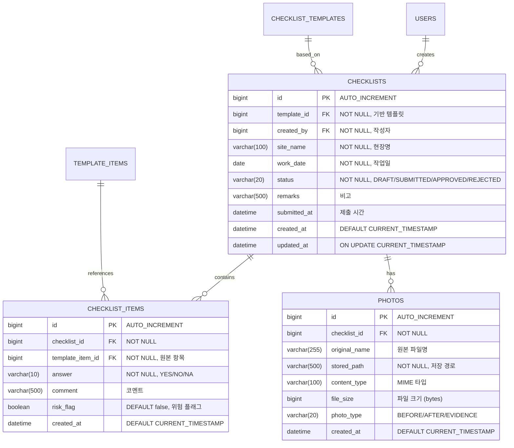
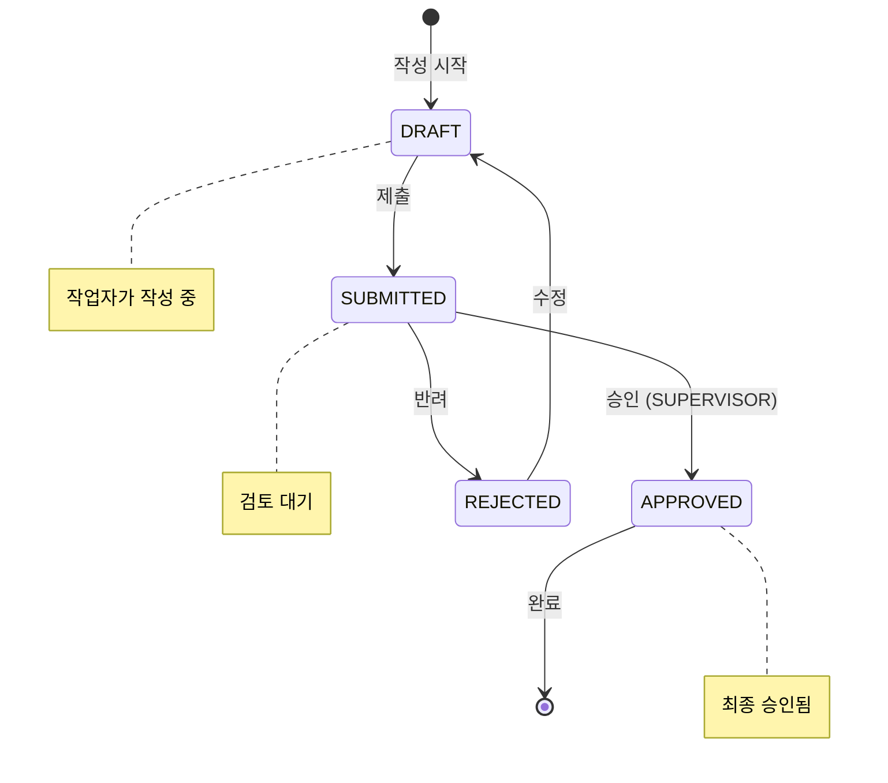
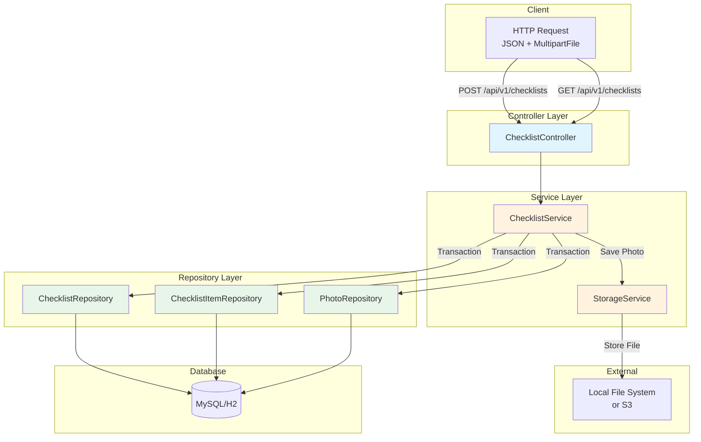

## 1. 배경 (Background)
작업자가 현장에서 입력한 점검 결과(O/X)와 사진을 저장하는 핵심 기능입니다.
관련 문서: `REQ-FUNC-03`

---

## 2. ERD (Entity Relationship Diagram)



### 상태 전이 다이어그램


---

## 3. CLD (Component Logic Diagram)



### 데이터 흐름 (체크리스트 제출)
```
1. [Client] POST /api/v1/checklists (JSON: ChecklistRequest + MultipartFile[])
2. [ChecklistController] request → ChecklistService.submit()
3. [ChecklistService] 
   3.1. SecurityContext에서 현재 사용자 조회
   3.2. Template 유효성 검증
   3.3. Checklist Entity 생성 (status = SUBMITTED)
4. [ChecklistService] ChecklistItem 생성
   4.1. 각 응답에 대해 ChecklistItem 생성
   4.2. answer == "NO" → riskFlag = true 설정
5. [StorageService] 사진 파일 저장
   5.1. 파일명 UUID로 변환
   5.2. 로컬/S3에 저장
   5.3. Photo Entity 생성
6. [ChecklistRepository] Checklist + Items + Photos 저장 (@Transactional)
7. [ChecklistController] ChecklistResponse 반환
```

---

## 4. ORM 예제 코드

### 4.1 Entity

```java
// domain/checklist/entity/Checklist.java
@Entity
@Table(name = "checklists")
@Getter
@NoArgsConstructor(access = AccessLevel.PROTECTED)
public class Checklist extends BaseTimeEntity {

    @Id
    @GeneratedValue(strategy = GenerationType.IDENTITY)
    private Long id;

    @ManyToOne(fetch = FetchType.LAZY)
    @JoinColumn(name = "template_id", nullable = false)
    private ChecklistTemplate template;

    @ManyToOne(fetch = FetchType.LAZY)
    @JoinColumn(name = "created_by", nullable = false)
    private User createdBy;

    @Column(nullable = false, length = 100)
    private String siteName;

    @Column(nullable = false)
    private LocalDate workDate;

    @Enumerated(EnumType.STRING)
    @Column(nullable = false, length = 20)
    private ChecklistStatus status = ChecklistStatus.DRAFT;

    @Column(length = 500)
    private String remarks;

    private LocalDateTime submittedAt;

    @OneToMany(mappedBy = "checklist", cascade = CascadeType.ALL, orphanRemoval = true)
    private List<ChecklistItem> items = new ArrayList<>();

    @OneToMany(mappedBy = "checklist", cascade = CascadeType.ALL, orphanRemoval = true)
    private List<Photo> photos = new ArrayList<>();

    @Builder
    public Checklist(ChecklistTemplate template, User createdBy, 
                     String siteName, LocalDate workDate) {
        this.template = template;
        this.createdBy = createdBy;
        this.siteName = siteName;
        this.workDate = workDate;
    }

    // 비즈니스 메서드: 제출
    public void submit() {
        if (this.status != ChecklistStatus.DRAFT) {
            throw new IllegalStateException("DRAFT 상태에서만 제출 가능합니다.");
        }
        this.status = ChecklistStatus.SUBMITTED;
        this.submittedAt = LocalDateTime.now();
    }

    // 비즈니스 메서드: 승인
    public void approve() {
        if (this.status != ChecklistStatus.SUBMITTED) {
            throw new IllegalStateException("SUBMITTED 상태에서만 승인 가능합니다.");
        }
        this.status = ChecklistStatus.APPROVED;
    }

    // 비즈니스 메서드: 반려
    public void reject() {
        if (this.status != ChecklistStatus.SUBMITTED) {
            throw new IllegalStateException("SUBMITTED 상태에서만 반려 가능합니다.");
        }
        this.status = ChecklistStatus.REJECTED;
    }

    // 항목 추가
    public void addItem(ChecklistItem item) {
        this.items.add(item);
        item.setChecklist(this);
    }

    // 사진 추가
    public void addPhoto(Photo photo) {
        this.photos.add(photo);
        photo.setChecklist(this);
    }

    // 위험 항목 개수 조회
    public long getRiskCount() {
        return items.stream()
            .filter(ChecklistItem::getRiskFlag)
            .count();
    }
}

// domain/checklist/entity/ChecklistStatus.java
public enum ChecklistStatus {
    DRAFT,      // 임시 저장
    SUBMITTED,  // 제출됨
    APPROVED,   // 승인됨
    REJECTED    // 반려됨
}

// domain/checklist/entity/ChecklistItem.java
@Entity
@Table(name = "checklist_items")
@Getter
@NoArgsConstructor(access = AccessLevel.PROTECTED)
public class ChecklistItem {

    @Id
    @GeneratedValue(strategy = GenerationType.IDENTITY)
    private Long id;

    @ManyToOne(fetch = FetchType.LAZY)
    @JoinColumn(name = "checklist_id", nullable = false)
    private Checklist checklist;

    @ManyToOne(fetch = FetchType.LAZY)
    @JoinColumn(name = "template_item_id", nullable = false)
    private TemplateItem templateItem;

    @Enumerated(EnumType.STRING)
    @Column(nullable = false, length = 10)
    private Answer answer;

    @Column(length = 500)
    private String comment;

    @Column(nullable = false)
    private Boolean riskFlag = false;

    @Builder
    public ChecklistItem(TemplateItem templateItem, Answer answer, String comment) {
        this.templateItem = templateItem;
        this.answer = answer;
        this.comment = comment;
        // "아니오" 응답 시 자동으로 위험 플래그 설정
        this.riskFlag = (answer == Answer.NO);
    }

    void setChecklist(Checklist checklist) {
        this.checklist = checklist;
    }
}

// domain/checklist/entity/Answer.java
public enum Answer {
    YES,  // 예
    NO,   // 아니오 → Risk Flag
    NA    // 해당 없음
}

// domain/checklist/entity/Photo.java
@Entity
@Table(name = "photos")
@Getter
@NoArgsConstructor(access = AccessLevel.PROTECTED)
public class Photo extends BaseTimeEntity {

    @Id
    @GeneratedValue(strategy = GenerationType.IDENTITY)
    private Long id;

    @ManyToOne(fetch = FetchType.LAZY)
    @JoinColumn(name = "checklist_id", nullable = false)
    private Checklist checklist;

    @Column(length = 255)
    private String originalName;

    @Column(nullable = false, length = 500)
    private String storedPath;

    @Column(length = 100)
    private String contentType;

    private Long fileSize;

    @Enumerated(EnumType.STRING)
    @Column(length = 20)
    private PhotoType photoType;

    @Builder
    public Photo(String originalName, String storedPath, 
                 String contentType, Long fileSize, PhotoType photoType) {
        this.originalName = originalName;
        this.storedPath = storedPath;
        this.contentType = contentType;
        this.fileSize = fileSize;
        this.photoType = photoType;
    }

    void setChecklist(Checklist checklist) {
        this.checklist = checklist;
    }

    public String getUrl() {
        return "/api/v1/files/" + this.storedPath;
    }
}

public enum PhotoType {
    BEFORE,   // 작업 전
    AFTER,    // 작업 후
    EVIDENCE  // 증빙
}
```

### 4.2 Repository

```java
// domain/checklist/repository/ChecklistRepository.java
public interface ChecklistRepository extends JpaRepository<Checklist, Long> {

    // 내 체크리스트 목록 (페이징)
    Page<Checklist> findByCreatedByIdOrderByCreatedAtDesc(Long userId, Pageable pageable);

    // 상태별 조회
    List<Checklist> findByStatus(ChecklistStatus status);

    // 위험 항목이 있는 체크리스트 조회
    @Query("SELECT DISTINCT c FROM Checklist c " +
           "JOIN c.items i " +
           "WHERE i.riskFlag = true AND c.status = :status")
    List<Checklist> findWithRiskItems(@Param("status") ChecklistStatus status);

    // 상세 조회 (N+1 방지)
    @Query("SELECT c FROM Checklist c " +
           "JOIN FETCH c.template t " +
           "JOIN FETCH c.createdBy " +
           "LEFT JOIN FETCH c.items " +
           "WHERE c.id = :id")
    Optional<Checklist> findByIdWithDetails(@Param("id") Long id);

    // 기간별 통계
    @Query("SELECT c.status, COUNT(c) FROM Checklist c " +
           "WHERE c.workDate BETWEEN :startDate AND :endDate " +
           "GROUP BY c.status")
    List<Object[]> countByStatusAndDateRange(
        @Param("startDate") LocalDate startDate,
        @Param("endDate") LocalDate endDate
    );
}
```

### 4.3 Service

```java
// domain/checklist/service/ChecklistService.java
@Service
@Transactional(readOnly = true)
@RequiredArgsConstructor
@Slf4j
public class ChecklistService {

    private final ChecklistRepository checklistRepository;
    private final ChecklistTemplateRepository templateRepository;
    private final StorageService storageService;

    @Transactional
    public ChecklistResponse submit(ChecklistRequest request, 
                                    List<MultipartFile> files, 
                                    User currentUser) {
        // 1. 템플릿 조회
        ChecklistTemplate template = templateRepository.findById(request.getTemplateId())
            .orElseThrow(() -> new CustomException(ErrorCode.TEMPLATE_NOT_FOUND));

        // 2. 체크리스트 생성
        Checklist checklist = Checklist.builder()
            .template(template)
            .createdBy(currentUser)
            .siteName(request.getSiteName())
            .workDate(request.getWorkDate())
            .build();

        // 3. 항목 추가 (위험 플래그 자동 설정)
        for (ChecklistItemRequest itemReq : request.getItems()) {
            TemplateItem templateItem = template.getItems().stream()
                .filter(ti -> ti.getId().equals(itemReq.getTemplateItemId()))
                .findFirst()
                .orElseThrow(() -> new CustomException(ErrorCode.INVALID_TEMPLATE_ITEM));

            ChecklistItem item = ChecklistItem.builder()
                .templateItem(templateItem)
                .answer(itemReq.getAnswer())
                .comment(itemReq.getComment())
                .build();

            checklist.addItem(item);
        }

        // 4. 사진 저장
        if (files != null && !files.isEmpty()) {
            for (MultipartFile file : files) {
                String storedPath = storageService.store(file);
                Photo photo = Photo.builder()
                    .originalName(file.getOriginalFilename())
                    .storedPath(storedPath)
                    .contentType(file.getContentType())
                    .fileSize(file.getSize())
                    .photoType(PhotoType.EVIDENCE)
                    .build();
                checklist.addPhoto(photo);
            }
        }

        // 5. 제출 처리
        checklist.submit();
        
        Checklist saved = checklistRepository.save(checklist);
        
        log.info("체크리스트 제출 완료: checklistId={}, userId={}, riskCount={}", 
                 saved.getId(), currentUser.getId(), saved.getRiskCount());

        return ChecklistResponse.from(saved);
    }

    public Page<ChecklistListResponse> getMyChecklists(User currentUser, Pageable pageable) {
        return checklistRepository
            .findByCreatedByIdOrderByCreatedAtDesc(currentUser.getId(), pageable)
            .map(ChecklistListResponse::from);
    }
}
```

---

## 5. 상세 작업 (Tasks)
- [ ] **Domain Modeling (`domain/checklist`)**
    - [ ] `Checklist` Entity (상태 전이 로직 포함)
    - [ ] `ChecklistItem` Entity (위험 플래그 자동 설정)
    - [ ] `ChecklistStatus` Enum (DRAFT/SUBMITTED/APPROVED/REJECTED)
    - [ ] `Answer` Enum (YES/NO/NA)
    - [ ] `Photo` Entity (파일 메타데이터)
    - [ ] Repository 생성 (JOIN FETCH, 통계 쿼리 포함)
- [ ] **File Upload Service**
    - [ ] `StorageService` 인터페이스 정의
    - [ ] `LocalStorageService` 구현체 (개발용)
    - [ ] 파일명 UUID 변환 + 확장자 검증
- [ ] **Service Layer**
    - [ ] `ChecklistService.submit()`: 템플릿 기반 생성 + 항목 저장 + 사진 저장
    - [ ] '아니오' 응답 시 Risk Flag 자동 설정
- [ ] **API Implementation**
    - [ ] `POST /api/v1/checklists`: 점검표 제출 (JSON + MultipartFile)
    - [ ] `GET /api/v1/checklists`: 내 점검표 목록 조회 (페이징)
    - [ ] `GET /api/v1/checklists/{id}`: 점검표 상세 조회

## 6. 완료 조건 (Acceptance Criteria)
- [ ] 사진 파일과 함께 체크리스트 데이터가 DB에 정상적으로 저장되어야 한다.
- [ ] 저장된 이미지를 조회할 수 있는 URL이 제공되어야 한다.
- [ ] '아니오' 응답 시 자동으로 riskFlag가 true로 설정되어야 한다.
- [ ] 상태 전이 규칙이 준수되어야 한다 (DRAFT → SUBMITTED만 허용).

