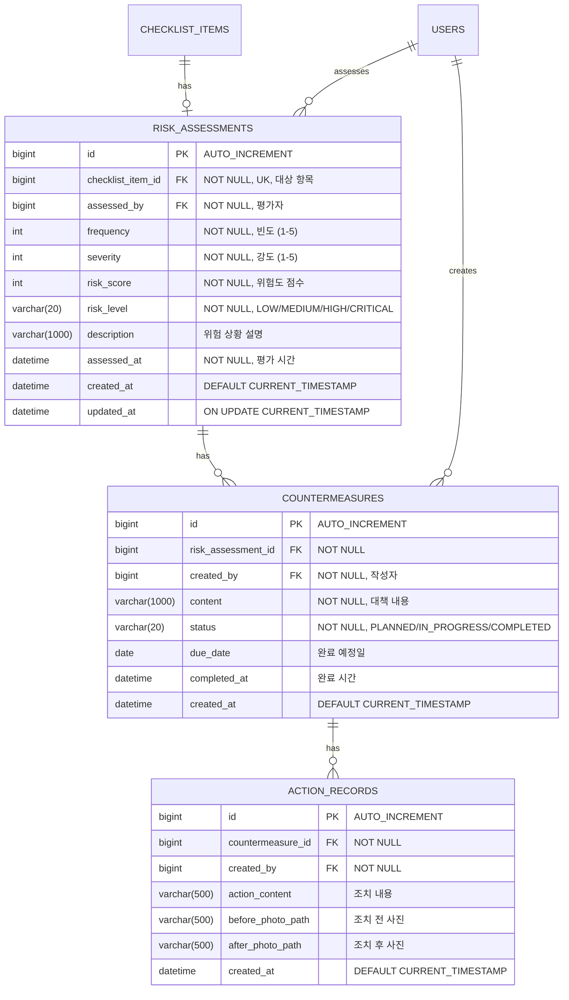

## 1. 배경 (Background)
체크리스트에서 발견된 위험 요인(Risk)에 대해 빈도/강도를 평가하고 개선 대책을 수립하는 기능입니다.
관련 문서: `REQ-FUNC-05`

---

## 2. ERD (Entity Relationship Diagram)



### 위험도 계산 매트릭스
| 빈도 \ 강도 | 1 (미미) | 2 (경미) | 3 (보통) | 4 (중대) | 5 (치명) |
|:---:|:---:|:---:|:---:|:---:|:---:|
| **5 (빈번)** | 5 | 10 | 15 | 20 | 25 |
| **4 (가끔)** | 4 | 8 | 12 | 16 | 20 |
| **3 (보통)** | 3 | 6 | 9 | 12 | 15 |
| **2 (드물게)** | 2 | 4 | 6 | 8 | 10 |
| **1 (거의없음)** | 1 | 2 | 3 | 4 | 5 |

**Risk Level 기준:**
- `LOW` (1-4): 허용 가능
- `MEDIUM` (5-9): 관리 필요
- `HIGH` (10-15): 즉시 조치 필요
- `CRITICAL` (16-25): 작업 중단 및 즉시 대책

---

## 3. CLD (Component Logic Diagram)

```mermaid
flowchart TB
    subgraph Client
        A[HTTP Request]
    end

    subgraph Controller Layer
        B[RiskController]
    end

    subgraph Service Layer
        C[RiskService]
        D[RiskCalculator]
    end

    subgraph Repository Layer
        E[RiskAssessmentRepository]
        F[CountermeasureRepository]
        G[ChecklistItemRepository]
    end

    subgraph Database
        H[(MySQL/H2)]
    end

    A -->|GET /api/v1/risks/pending| B
    A -->|POST /api/v1/risks/{id}/assess| B
    B --> C
    C -->|Calculate Score| D
    C --> E
    C --> F
    C --> G
    E --> H
    F --> H
    G --> H

    style B fill:#e1f5fe
    style C fill:#fff3e0
    style D fill:#fff3e0
    style E fill:#e8f5e9
    style F fill:#e8f5e9
```

### 데이터 흐름 (위험성 평가)
```
1. [Client] POST /api/v1/risks/{checklistItemId}/assess
   { frequency: 3, severity: 4, description: "...", countermeasures: [...] }
2. [RiskController] request → RiskService.assess()
3. [RiskService]
   3.1. ChecklistItem 조회 (riskFlag == true 검증)
   3.2. RiskCalculator.calculate(frequency, severity) → riskScore, riskLevel
4. [RiskService] RiskAssessment Entity 생성 및 저장
5. [RiskService] Countermeasure Entity 생성 및 저장
6. [RiskController] RiskAssessmentResponse 반환
```

---

## 4. ORM 예제 코드

### 4.1 Entity

```java
// domain/risk/entity/RiskAssessment.java
@Entity
@Table(name = "risk_assessments")
@Getter
@NoArgsConstructor(access = AccessLevel.PROTECTED)
public class RiskAssessment extends BaseTimeEntity {

    @Id
    @GeneratedValue(strategy = GenerationType.IDENTITY)
    private Long id;

    @OneToOne(fetch = FetchType.LAZY)
    @JoinColumn(name = "checklist_item_id", nullable = false, unique = true)
    private ChecklistItem checklistItem;

    @ManyToOne(fetch = FetchType.LAZY)
    @JoinColumn(name = "assessed_by", nullable = false)
    private User assessedBy;

    @Column(nullable = false)
    private Integer frequency; // 1-5

    @Column(nullable = false)
    private Integer severity;  // 1-5

    @Column(nullable = false)
    private Integer riskScore; // frequency * severity

    @Enumerated(EnumType.STRING)
    @Column(nullable = false, length = 20)
    private RiskLevel riskLevel;

    @Column(length = 1000)
    private String description;

    @Column(nullable = false)
    private LocalDateTime assessedAt;

    @OneToMany(mappedBy = "riskAssessment", cascade = CascadeType.ALL, orphanRemoval = true)
    private List<Countermeasure> countermeasures = new ArrayList<>();

    @Builder
    public RiskAssessment(ChecklistItem checklistItem, User assessedBy,
                          Integer frequency, Integer severity, String description) {
        this.checklistItem = checklistItem;
        this.assessedBy = assessedBy;
        this.frequency = frequency;
        this.severity = severity;
        this.description = description;
        this.assessedAt = LocalDateTime.now();
        
        // 위험도 자동 계산
        this.riskScore = RiskCalculator.calculateScore(frequency, severity);
        this.riskLevel = RiskCalculator.determineLevel(this.riskScore);
    }

    public void addCountermeasure(Countermeasure countermeasure) {
        this.countermeasures.add(countermeasure);
        countermeasure.setRiskAssessment(this);
    }
}

// domain/risk/entity/RiskLevel.java
public enum RiskLevel {
    LOW,      // 1-4: 허용 가능
    MEDIUM,   // 5-9: 관리 필요
    HIGH,     // 10-15: 즉시 조치 필요
    CRITICAL  // 16-25: 작업 중단
}

// domain/risk/entity/Countermeasure.java
@Entity
@Table(name = "countermeasures")
@Getter
@NoArgsConstructor(access = AccessLevel.PROTECTED)
public class Countermeasure extends BaseTimeEntity {

    @Id
    @GeneratedValue(strategy = GenerationType.IDENTITY)
    private Long id;

    @ManyToOne(fetch = FetchType.LAZY)
    @JoinColumn(name = "risk_assessment_id", nullable = false)
    private RiskAssessment riskAssessment;

    @ManyToOne(fetch = FetchType.LAZY)
    @JoinColumn(name = "created_by", nullable = false)
    private User createdBy;

    @Column(nullable = false, length = 1000)
    private String content;

    @Enumerated(EnumType.STRING)
    @Column(nullable = false, length = 20)
    private CountermeasureStatus status = CountermeasureStatus.PLANNED;

    private LocalDate dueDate;

    private LocalDateTime completedAt;

    @Builder
    public Countermeasure(User createdBy, String content, LocalDate dueDate) {
        this.createdBy = createdBy;
        this.content = content;
        this.dueDate = dueDate;
    }

    void setRiskAssessment(RiskAssessment riskAssessment) {
        this.riskAssessment = riskAssessment;
    }

    // 비즈니스 메서드: 완료 처리
    public void complete() {
        this.status = CountermeasureStatus.COMPLETED;
        this.completedAt = LocalDateTime.now();
    }
}

public enum CountermeasureStatus {
    PLANNED,     // 계획됨
    IN_PROGRESS, // 진행 중
    COMPLETED    // 완료
}
```

### 4.2 RiskCalculator (Domain Service)

```java
// domain/risk/service/RiskCalculator.java
public class RiskCalculator {

    private RiskCalculator() {} // Utility class

    /**
     * 위험도 점수 계산: 빈도 × 강도
     */
    public static int calculateScore(int frequency, int severity) {
        validateRange(frequency, "frequency");
        validateRange(severity, "severity");
        return frequency * severity;
    }

    /**
     * 위험도 레벨 판정
     */
    public static RiskLevel determineLevel(int score) {
        if (score <= 4) return RiskLevel.LOW;
        if (score <= 9) return RiskLevel.MEDIUM;
        if (score <= 15) return RiskLevel.HIGH;
        return RiskLevel.CRITICAL;
    }

    private static void validateRange(int value, String fieldName) {
        if (value < 1 || value > 5) {
            throw new IllegalArgumentException(
                fieldName + "는 1~5 사이의 값이어야 합니다: " + value);
        }
    }
}
```

### 4.3 Repository

```java
// domain/risk/repository/RiskAssessmentRepository.java
public interface RiskAssessmentRepository extends JpaRepository<RiskAssessment, Long> {

    Optional<RiskAssessment> findByChecklistItemId(Long checklistItemId);

    boolean existsByChecklistItemId(Long checklistItemId);

    // 위험 레벨별 조회
    List<RiskAssessment> findByRiskLevelOrderByAssessedAtDesc(RiskLevel riskLevel);

    // 고위험 항목 (HIGH, CRITICAL)
    @Query("SELECT ra FROM RiskAssessment ra " +
           "WHERE ra.riskLevel IN ('HIGH', 'CRITICAL') " +
           "ORDER BY ra.riskScore DESC")
    List<RiskAssessment> findHighRiskItems();

    // 대시보드 통계
    @Query("SELECT ra.riskLevel, COUNT(ra) FROM RiskAssessment ra " +
           "GROUP BY ra.riskLevel")
    List<Object[]> countByRiskLevel();
}

// domain/risk/repository/CountermeasureRepository.java
public interface CountermeasureRepository extends JpaRepository<Countermeasure, Long> {

    List<Countermeasure> findByStatusNot(CountermeasureStatus status);

    // 기한 초과 미완료 대책
    @Query("SELECT c FROM Countermeasure c " +
           "WHERE c.status != 'COMPLETED' AND c.dueDate < :today")
    List<Countermeasure> findOverdue(@Param("today") LocalDate today);
}
```

### 4.4 Service

```java
// domain/risk/service/RiskService.java
@Service
@Transactional(readOnly = true)
@RequiredArgsConstructor
@Slf4j
public class RiskService {

    private final RiskAssessmentRepository riskAssessmentRepository;
    private final ChecklistItemRepository checklistItemRepository;

    /**
     * 위험성 평가 대상 목록 조회 (riskFlag == true && 미평가)
     */
    public List<PendingRiskResponse> getPendingRisks() {
        List<ChecklistItem> pendingItems = checklistItemRepository
            .findByRiskFlagTrueAndRiskAssessmentIsNull();
        
        return pendingItems.stream()
            .map(PendingRiskResponse::from)
            .toList();
    }

    /**
     * 위험성 평가 등록
     */
    @Transactional
    public RiskAssessmentResponse assess(Long checklistItemId, 
                                         RiskAssessRequest request,
                                         User currentUser) {
        // 1. 대상 항목 조회
        ChecklistItem item = checklistItemRepository.findById(checklistItemId)
            .orElseThrow(() -> new CustomException(ErrorCode.CHECKLIST_ITEM_NOT_FOUND));

        // 2. 이미 평가된 항목인지 검증
        if (riskAssessmentRepository.existsByChecklistItemId(checklistItemId)) {
            throw new CustomException(ErrorCode.ALREADY_ASSESSED);
        }

        // 3. 위험 플래그 검증
        if (!item.getRiskFlag()) {
            throw new CustomException(ErrorCode.NOT_RISK_ITEM);
        }

        // 4. 평가 생성 (점수/레벨 자동 계산)
        RiskAssessment assessment = RiskAssessment.builder()
            .checklistItem(item)
            .assessedBy(currentUser)
            .frequency(request.getFrequency())
            .severity(request.getSeverity())
            .description(request.getDescription())
            .build();

        // 5. 대책 추가
        for (CountermeasureRequest cmReq : request.getCountermeasures()) {
            Countermeasure countermeasure = Countermeasure.builder()
                .createdBy(currentUser)
                .content(cmReq.getContent())
                .dueDate(cmReq.getDueDate())
                .build();
            assessment.addCountermeasure(countermeasure);
        }

        RiskAssessment saved = riskAssessmentRepository.save(assessment);

        log.info("위험성 평가 완료: itemId={}, score={}, level={}", 
                 checklistItemId, saved.getRiskScore(), saved.getRiskLevel());

        return RiskAssessmentResponse.from(saved);
    }
}
```

---

## 5. 상세 작업 (Tasks)
- [ ] **Domain Modeling (`domain/risk`)**
    - [ ] `RiskAssessment` Entity (빈도, 강도, 위험도 자동 계산)
    - [ ] `RiskLevel` Enum (LOW/MEDIUM/HIGH/CRITICAL)
    - [ ] `Countermeasure` Entity (개선 대책)
    - [ ] `CountermeasureStatus` Enum (PLANNED/IN_PROGRESS/COMPLETED)
    - [ ] `RiskCalculator` Domain Service (점수 계산 로직)
    - [ ] Repository 생성 (통계 쿼리 포함)
- [ ] **Service Layer**
    - [ ] 위험도 계산 로직 (빈도 × 강도 = 위험성)
    - [ ] 중복 평가 방지 검증
- [ ] **API Implementation**
    - [ ] `GET /api/v1/risks/pending`: 위험성 평가 대상 목록 조회
    - [ ] `POST /api/v1/risks/{checklistItemId}/assess`: 평가 및 대책 저장
    - [ ] `GET /api/v1/risks/statistics`: 위험 현황 통계

## 6. 완료 조건 (Acceptance Criteria)
- [ ] '아니오'로 체크된 항목들이 평가 대상 목록에 조회되어야 한다.
- [ ] 빈도와 강도를 입력하면 위험도 점수가 자동 계산되어 저장되어야 한다.
- [ ] 위험도 레벨이 매트릭스 기준에 따라 자동 판정되어야 한다.
- [ ] 동일 항목에 대한 중복 평가가 방지되어야 한다.

