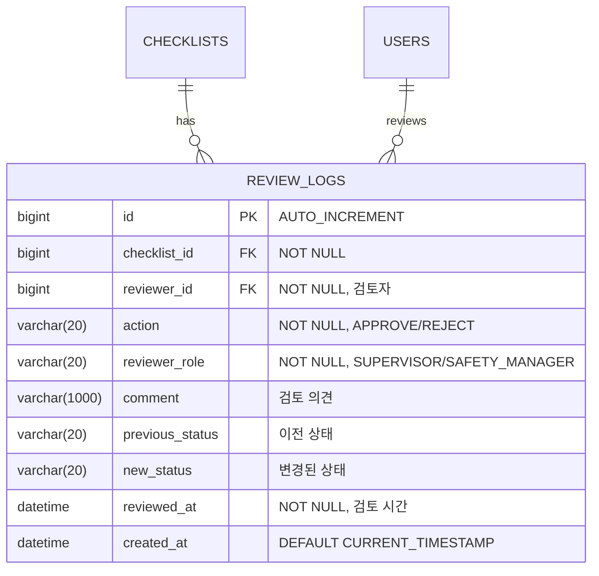
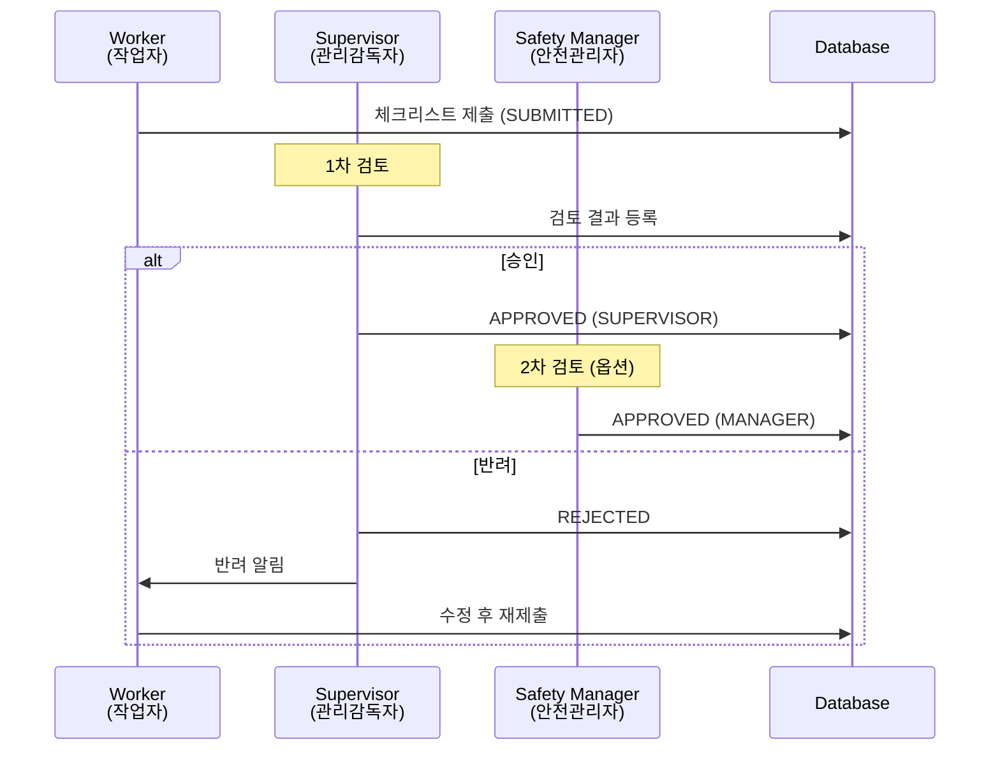

## 1. 배경 (Background)
작성된 체크리스트와 위험성 평가 결과를 관리자가 검토하고 최종 승인(결재)하는 프로세스입니다.
관련 문서: `REQ-FUNC-04`

---

## 2. ERD (Entity Relationship Diagram)



### 결재 플로우 (Approval Flow)


### 상태 전이 규칙
| 현재 상태 | 가능한 액션 | 필요 권한 | 결과 상태 |
|:---:|:---:|:---:|:---:|
| `SUBMITTED` | 승인 | SUPERVISOR | `APPROVED` |
| `SUBMITTED` | 반려 | SUPERVISOR | `REJECTED` |
| `REJECTED` | 재제출 | WORKER | `SUBMITTED` |
| `APPROVED` | - | - | (최종 상태) |

---

## 3. CLD (Component Logic Diagram)

```mermaid
flowchart TB
    subgraph Client
        A[HTTP Request]
    end

    subgraph Controller Layer
        B[ReviewController]
    end

    subgraph Service Layer
        C[ReviewService]
        D[ChecklistService]
    end

    subgraph Event System
        E[ApplicationEventPublisher]
    end

    subgraph Repository Layer
        F[ReviewLogRepository]
        G[ChecklistRepository]
    end

    subgraph Notification
        H[NotificationService]
    end

    subgraph Database
        I[(MySQL/H2)]
    end

    A -->|POST /api/v1/reviews/{id}| B
    A -->|GET /api/v1/reviews/pending| B
    B -->|@PreAuthorize| C
    C --> D
    C --> F
    D --> G
    C -->|Publish Event| E
    E -->|Async| H
    F --> I
    G --> I

    style B fill:#e1f5fe
    style C fill:#fff3e0
    style D fill:#fff3e0
    style F fill:#e8f5e9
    style G fill:#e8f5e9
```

### 데이터 흐름 (검토/승인)
```
1. [Client] POST /api/v1/reviews/{checklistId}
   { action: "APPROVE", comment: "검토 완료" }
2. [ReviewController] @PreAuthorize("hasRole('SUPERVISOR')") 검증
3. [ReviewService]
   3.1. Checklist 조회 (status == SUBMITTED 검증)
   3.2. ReviewLog 생성 (이전/이후 상태 기록)
   3.3. Checklist.approve() 또는 Checklist.reject() 호출
4. [ApplicationEventPublisher] 
   4.1. ReviewCompletedEvent 발행
   4.2. (반려 시) NotificationService가 비동기로 알림 전송
5. [ReviewController] ReviewResponse 반환
```

---

## 4. ORM 예제 코드

### 4.1 Entity

```java
// domain/review/entity/ReviewLog.java
@Entity
@Table(name = "review_logs")
@Getter
@NoArgsConstructor(access = AccessLevel.PROTECTED)
public class ReviewLog extends BaseTimeEntity {

    @Id
    @GeneratedValue(strategy = GenerationType.IDENTITY)
    private Long id;

    @ManyToOne(fetch = FetchType.LAZY)
    @JoinColumn(name = "checklist_id", nullable = false)
    private Checklist checklist;

    @ManyToOne(fetch = FetchType.LAZY)
    @JoinColumn(name = "reviewer_id", nullable = false)
    private User reviewer;

    @Enumerated(EnumType.STRING)
    @Column(nullable = false, length = 20)
    private ReviewAction action;

    @Enumerated(EnumType.STRING)
    @Column(nullable = false, length = 20)
    private Role reviewerRole;

    @Column(length = 1000)
    private String comment;

    @Enumerated(EnumType.STRING)
    @Column(length = 20)
    private ChecklistStatus previousStatus;

    @Enumerated(EnumType.STRING)
    @Column(length = 20)
    private ChecklistStatus newStatus;

    @Column(nullable = false)
    private LocalDateTime reviewedAt;

    @Builder
    public ReviewLog(Checklist checklist, User reviewer, ReviewAction action,
                     String comment, ChecklistStatus previousStatus) {
        this.checklist = checklist;
        this.reviewer = reviewer;
        this.action = action;
        this.reviewerRole = reviewer.getRole();
        this.comment = comment;
        this.previousStatus = previousStatus;
        this.reviewedAt = LocalDateTime.now();
        
        // 액션에 따른 새 상태 설정
        this.newStatus = (action == ReviewAction.APPROVE) 
            ? ChecklistStatus.APPROVED 
            : ChecklistStatus.REJECTED;
    }
}

// domain/review/entity/ReviewAction.java
public enum ReviewAction {
    APPROVE,  // 승인
    REJECT    // 반려
}
```

### 4.2 Repository

```java
// domain/review/repository/ReviewLogRepository.java
public interface ReviewLogRepository extends JpaRepository<ReviewLog, Long> {

    // 체크리스트별 검토 이력
    List<ReviewLog> findByChecklistIdOrderByReviewedAtDesc(Long checklistId);

    // 검토자별 처리 내역
    Page<ReviewLog> findByReviewerIdOrderByReviewedAtDesc(Long reviewerId, Pageable pageable);

    // 특정 기간 검토 통계
    @Query("SELECT rl.action, COUNT(rl) FROM ReviewLog rl " +
           "WHERE rl.reviewedAt BETWEEN :startDate AND :endDate " +
           "GROUP BY rl.action")
    List<Object[]> countByActionAndDateRange(
        @Param("startDate") LocalDateTime startDate,
        @Param("endDate") LocalDateTime endDate
    );

    // 검토 대기 목록 (Checklist 조인)
    @Query("SELECT c FROM Checklist c " +
           "WHERE c.status = 'SUBMITTED' " +
           "ORDER BY c.submittedAt ASC")
    List<Checklist> findPendingReviews();
}
```

### 4.3 Service

```java
// domain/review/service/ReviewService.java
@Service
@Transactional(readOnly = true)
@RequiredArgsConstructor
@Slf4j
public class ReviewService {

    private final ReviewLogRepository reviewLogRepository;
    private final ChecklistRepository checklistRepository;
    private final ApplicationEventPublisher eventPublisher;

    /**
     * 검토 대기 목록 조회
     */
    public List<PendingReviewResponse> getPendingReviews() {
        List<Checklist> pendingList = reviewLogRepository.findPendingReviews();
        return pendingList.stream()
            .map(PendingReviewResponse::from)
            .toList();
    }

    /**
     * 검토 결과 등록 (승인/반려)
     */
    @Transactional
    public ReviewResponse review(Long checklistId, ReviewRequest request, User reviewer) {
        // 1. 체크리스트 조회
        Checklist checklist = checklistRepository.findById(checklistId)
            .orElseThrow(() -> new CustomException(ErrorCode.CHECKLIST_NOT_FOUND));

        // 2. 상태 검증
        if (checklist.getStatus() != ChecklistStatus.SUBMITTED) {
            throw new CustomException(ErrorCode.INVALID_CHECKLIST_STATUS);
        }

        // 3. 이전 상태 저장
        ChecklistStatus previousStatus = checklist.getStatus();

        // 4. 검토 로그 생성
        ReviewLog reviewLog = ReviewLog.builder()
            .checklist(checklist)
            .reviewer(reviewer)
            .action(request.getAction())
            .comment(request.getComment())
            .previousStatus(previousStatus)
            .build();

        // 5. 체크리스트 상태 변경
        if (request.getAction() == ReviewAction.APPROVE) {
            checklist.approve();
            log.info("체크리스트 승인: checklistId={}, reviewerId={}", 
                     checklistId, reviewer.getId());
        } else {
            checklist.reject();
            log.info("체크리스트 반려: checklistId={}, reviewerId={}, reason={}", 
                     checklistId, reviewer.getId(), request.getComment());
            
            // 반려 이벤트 발행 (알림용)
            eventPublisher.publishEvent(new ReviewRejectedEvent(
                checklist.getCreatedBy().getId(),
                checklistId,
                request.getComment()
            ));
        }

        // 6. 저장
        reviewLogRepository.save(reviewLog);
        checklistRepository.save(checklist);

        return ReviewResponse.from(reviewLog);
    }

    /**
     * 특정 체크리스트의 검토 이력 조회
     */
    public List<ReviewHistoryResponse> getReviewHistory(Long checklistId) {
        List<ReviewLog> logs = reviewLogRepository
            .findByChecklistIdOrderByReviewedAtDesc(checklistId);
        
        return logs.stream()
            .map(ReviewHistoryResponse::from)
            .toList();
    }
}
```

### 4.4 Event (반려 알림용)

```java
// domain/review/event/ReviewRejectedEvent.java
@Getter
@AllArgsConstructor
public class ReviewRejectedEvent {
    private final Long userId;        // 알림 대상 (작성자)
    private final Long checklistId;   // 반려된 체크리스트
    private final String reason;      // 반려 사유
}

// domain/notification/listener/ReviewEventListener.java
@Component
@RequiredArgsConstructor
@Slf4j
public class ReviewEventListener {

    private final NotificationService notificationService;

    @Async
    @EventListener
    public void handleReviewRejected(ReviewRejectedEvent event) {
        log.info("반려 알림 발송: userId={}, checklistId={}", 
                 event.getUserId(), event.getChecklistId());
        
        notificationService.send(
            event.getUserId(),
            "체크리스트가 반려되었습니다",
            "반려 사유: " + event.getReason()
        );
    }
}
```

---

## 5. 상세 작업 (Tasks)
- [ ] **Domain Modeling (`domain/review`)**
    - [ ] `ReviewLog` Entity (검토 이력)
    - [ ] `ReviewAction` Enum (APPROVE/REJECT)
    - [ ] Repository 생성 (검토 대기 목록, 이력 조회)
- [ ] **Service Layer**
    - [ ] 상태 변경 로직 (SUBMITTED → APPROVED/REJECTED)
    - [ ] 상태 검증 (SUBMITTED 상태만 검토 가능)
    - [ ] 검토 이력 자동 기록
- [ ] **Event System**
    - [ ] `ReviewRejectedEvent` 정의
    - [ ] `ReviewEventListener` (비동기 알림)
- [ ] **API Implementation**
    - [ ] `GET /api/v1/reviews/pending`: 검토 대기 목록
    - [ ] `POST /api/v1/reviews/{checklistId}`: 검토 결과 등록
    - [ ] `GET /api/v1/reviews/{checklistId}/history`: 검토 이력 조회

## 6. 완료 조건 (Acceptance Criteria)
- [ ] 관리자 권한(`ROLE_SUPERVISOR`)만 승인 API를 호출할 수 있어야 한다.
- [ ] 승인 완료 시 체크리스트의 최종 상태가 `APPROVED`가 되어야 한다.
- [ ] 모든 검토 내역이 `review_logs` 테이블에 기록되어야 한다.
- [ ] 반려 시 작성자에게 알림이 발송되어야 한다 (옵션).

