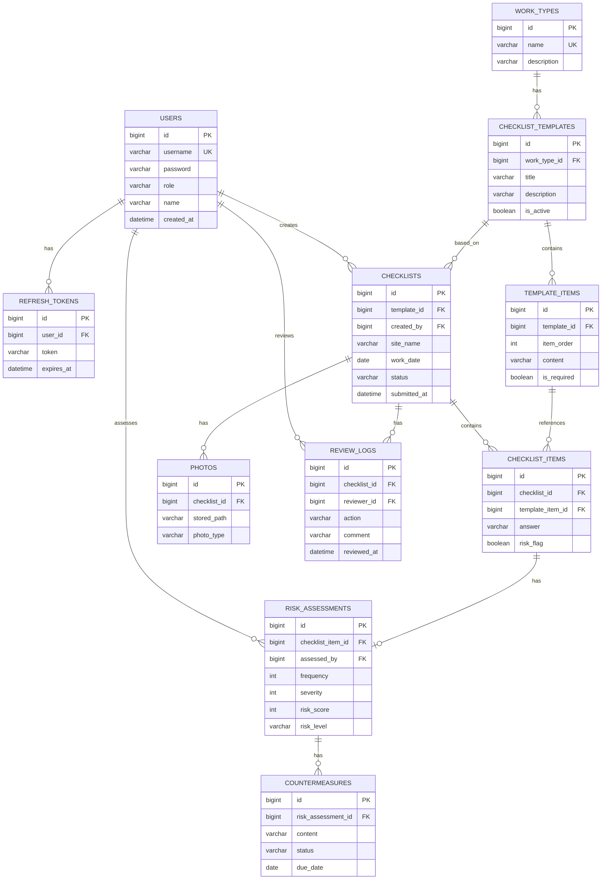
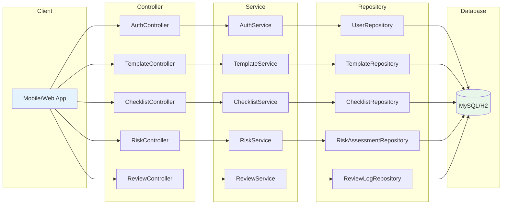
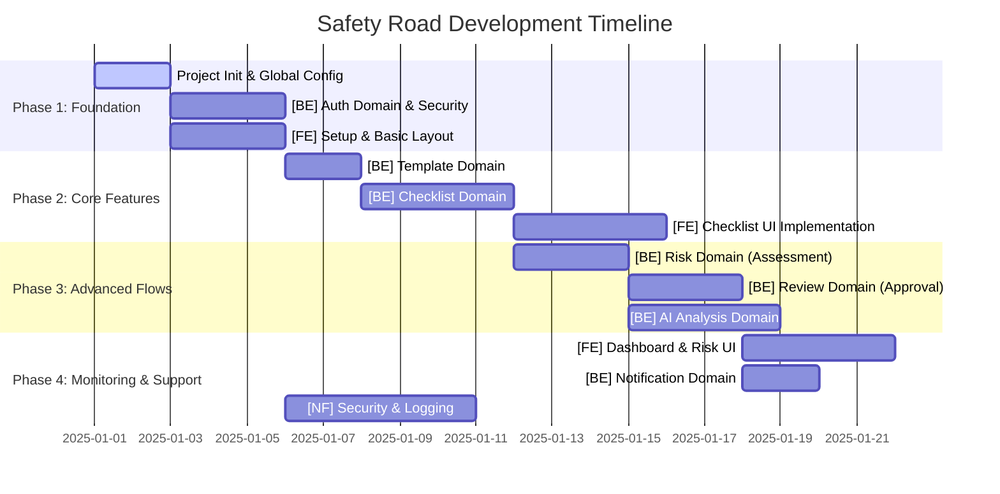
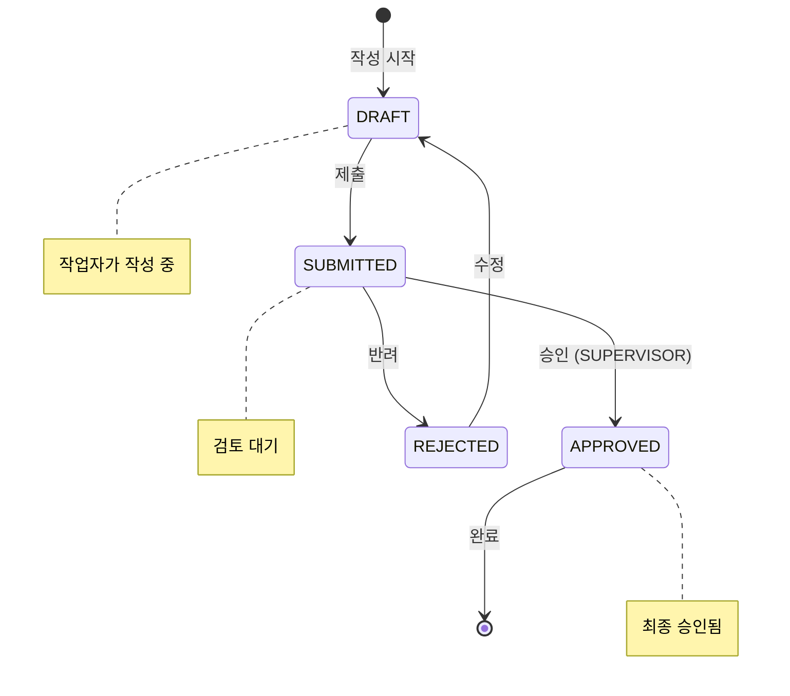

# 작업 수행 순서 및 의존성 가이드 (ISSUES)

본 문서는 Github Issues에 등록된 작업들의 권장 수행 순서와 병렬 진행 가이드를 정의합니다.
Backend의 DAG(Directed Acyclic Graph) 구조와 Frontend의 MVP 요구사항을 기반으로 작성되었습니다.

---

## 🗂️ 전체 ERD 관계도 (Entity Relationship Diagram)

---

## 📚 도메인별 상세 설계 문서

각 백엔드 이슈에는 **ERD**, **CLD (Component Logic Diagram)**, **ORM 예제 코드**가 포함되어 있습니다.

| Issue | 도메인 | 핵심 Entity | ERD | CLD | ORM |
|:---:|:---|:---|:---:|:---:|:---:|
| [ISSUE-003](./ISSUE-003-BE-Auth.md) | **Auth** | `User`, `RefreshToken` | ✅ | ✅ | ✅ |
| [ISSUE-005](./ISSUE-005-BE-Template.md) | **Template** | `WorkType`, `ChecklistTemplate`, `TemplateItem` | ✅ | ✅ | ✅ |
| [ISSUE-006](./ISSUE-006-BE-Checklist.md) | **Checklist** | `Checklist`, `ChecklistItem`, `Photo` | ✅ | ✅ | ✅ |
| [ISSUE-008](./ISSUE-008-BE-Risk.md) | **Risk** | `RiskAssessment`, `Countermeasure` | ✅ | ✅ | ✅ |
| [ISSUE-009](./ISSUE-009-BE-Review.md) | **Review** | `ReviewLog` | ✅ | ✅ | ✅ |

---

## 🔄 데이터 흐름 요약 (3-Tier Architecture)

### 구현 순서 (Repository → Service → Controller)

| 순서 | 레이어 | 설명 | 의존성 |
|:---:|:---|:---|:---|
| 1️⃣ | **Entity** | JPA Entity 클래스 정의 | BaseTimeEntity |
| 2️⃣ | **Repository** | Spring Data JPA 인터페이스 | Entity |
| 3️⃣ | **Service** | 비즈니스 로직 (트랜잭션) | Repository |
| 4️⃣ | **Controller** | REST API 엔드포인트 | Service |
| 5️⃣ | **DTO** | Request/Response 객체 | Entity 변환 |

---

## 📌 전체 로드맵 (Overview)

---

## 📋 상세 수행 순서 (Detailed Execution Order)

### Phase 1: Foundation (기반 구축)

| Order | Issue ID | Title | Dependency | Parallelizable |
|:---:|:---:|:---|:---|:---:|
| 1 | **ISSUE-001** | **[INIT] 프로젝트 초기화 및 CI/CD 환경 구성** | - | No |
| 2 | **ISSUE-002** | **[BE] Global 패키지 및 공통 설정 구현** | ISSUE-001 | No |
| 3 | **ISSUE-003** | **[BE] Auth 도메인: 인증/인가 및 JWT 구현** | ISSUE-002 | No |
| 4 | **ISSUE-004** | **[FE] 프로젝트 셋업 및 메인 레이아웃 (PoC)** | ISSUE-001 | **Yes (with BE)** |

> **💡 Guide**: `ISSUE-004`는 백엔드 API 없이 Mock 데이터를 활용하여 레이아웃을 잡는 작업이므로 백엔드(002, 003)와 동시에 진행 가능합니다.

### Phase 2: Core Features (핵심 기능)

| Order | Issue ID | Title | Dependency | Parallelizable |
|:---:|:---:|:---|:---|:---:|
| 5 | **ISSUE-005** | **[BE] Template 도메인: 표준 점검표 관리** | ISSUE-002 | No |
| 6 | **ISSUE-006** | **[BE] Checklist 도메인: 작성 및 저장 구현** | ISSUE-005, ISSUE-003 | No |
| 7 | **ISSUE-007** | **[FE] 체크리스트 작성 폼 UI 및 연동** | ISSUE-006, ISSUE-004 | No |

> **💡 Guide**: `ISSUE-006`(체크리스트 BE)이 완료되어야 `ISSUE-007`(체크리스트 FE)의 실제 API 연동이 가능합니다.

### Phase 3: Advanced Flows (심화 로직)

| Order | Issue ID | Title | Dependency | Parallelizable |
|:---:|:---:|:---|:---|:---:|
| 8 | **ISSUE-008** | **[BE] Risk 도메인: 위험성 평가 및 대책 수립** | ISSUE-006 | **Yes (with Review)** |
| 9 | **ISSUE-009** | **[BE] Review 도메인: 검토 및 승인 프로세스** | ISSUE-006 | **Yes (with Risk)** |
| 10 | **ISSUE-010** | **[BE] AI 도메인: 위험도 분석 및 개선안 제안** | ISSUE-006, ISSUE-008 | No |

> **💡 Guide**: `Risk`와 `Review`는 모두 `Checklist` 데이터에 의존하지만, 서로 직접적인 의존성이 낮아 병렬 개발이 가능합니다. 단, `AI` 기능은 `Risk` 데이터 구조가 확정된 후 진행하는 것이 안전합니다.

### Phase 4: Monitoring & Support (모니터링 및 지원)

| Order | Issue ID | Title | Dependency | Parallelizable |
|:---:|:---:|:---|:---|:---:|
| 11 | **ISSUE-011** | **[FE] 대시보드 및 위험 현황 시각화** | ISSUE-008, ISSUE-009 | **Yes** |
| 12 | **ISSUE-012** | **[BE] Notification 도메인: 알림 서비스** | ISSUE-009 | **Yes** |
| 13 | **ISSUE-013** | **[NF] 보안 감사(Audit) 및 로깅 시스템** | ISSUE-003 | **Yes (Continuous)** |

---

## 🛠 기술 스택 및 참조 문서

- **Backend**: Java 21, Spring Boot 3.3.x, JPA/Hibernate 6.x, MySQL 8.x
- **Frontend**: React 18, TypeScript 5.x, Vite 5.x, TailwindCSS 3.x
- **Security**: Spring Security 6.x, JWT (jjwt 0.12.x)
- **Docs**:
  - `backend/DAG.md`: 백엔드 패키지 구조도
  - `docs/`: 요구사항 명세서 폴더
  - `rules/`: 프로젝트 코딩 규칙

---

## 📊 핵심 비즈니스 로직 참조

### 체크리스트 상태 전이 (State Machine)

### 위험도 계산 매트릭스 (Risk Assessment)

| 빈도 \ 강도 | 1 (미미) | 2 (경미) | 3 (보통) | 4 (중대) | 5 (치명) |
|:---:|:---:|:---:|:---:|:---:|:---:|
| **5 (빈번)** | 5 🟢 | 10 🟡 | 15 🟠 | 20 🔴 | 25 🔴 |
| **4 (가끔)** | 4 🟢 | 8 🟡 | 12 🟠 | 16 🔴 | 20 🔴 |
| **3 (보통)** | 3 🟢 | 6 🟡 | 9 🟡 | 12 🟠 | 15 🟠 |
| **2 (드물게)** | 2 🟢 | 4 🟢 | 6 🟡 | 8 🟡 | 10 🟡 |
| **1 (거의없음)** | 1 🟢 | 2 🟢 | 3 🟢 | 4 🟢 | 5 🟢 |

**Risk Level 기준:**
- 🟢 `LOW` (1-4): 허용 가능
- 🟡 `MEDIUM` (5-9): 관리 필요
- 🟠 `HIGH` (10-15): 즉시 조치 필요
- 🔴 `CRITICAL` (16-25): 작업 중단 및 즉시 대책

---

## ✅ 진행 상황 체크리스트

| Phase | Issue | 상태 | 비고 |
|:---:|:---|:---:|:---|
| 1 | ISSUE-001 (Init) | ✅ | 프로젝트 초기화 완료 |
| 1 | ISSUE-002 (Global) | ✅ | 전체 완료 (Config, Common, Error) |
| 1 | ISSUE-003 (Auth) | ✅ | JWT 인증/인가 완료, 4개 테스트 계정 생성 |
| 1 | ISSUE-004 (FE Layout) | ⬜ | - |
| 2 | ISSUE-005 (Template) | ✅ | 3개 작업 유형, 템플릿 + 항목 시딩 완료 |
| 2 | ISSUE-006 (Checklist) | ⬜ | ERD/CLD/ORM 문서화 완료 |
| 2 | ISSUE-007 (FE Checklist) | ⬜ | - |
| 3 | ISSUE-008 (Risk) | ⬜ | ERD/CLD/ORM 문서화 완료 |
| 3 | ISSUE-009 (Review) | ⬜ | ERD/CLD/ORM 문서화 완료 |
| 3 | ISSUE-010 (AI) | ⬜ | - |
| 4 | ISSUE-011 (FE Dashboard) | ⬜ | - |
| 4 | ISSUE-012 (Notification) | ⬜ | - |
| 4 | ISSUE-013 (Security) | ⬜ | - |

**범례:** ✅ 완료 | 🔄 진행 중 | ⬜ 대기

