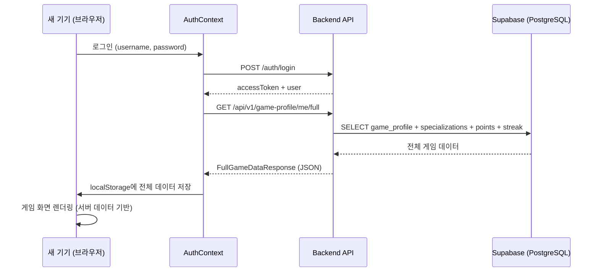

# 게임 프로필 Supabase 저장 기능 구현

> **작성일**: 2026-02-11  
> **상태**: 1단계 구현 완료 ✅  
> **목표**: 브라우저 localStorage에만 저장되던 게임 데이터를 Supabase(PostgreSQL) 백엔드에 저장하고, 다른 기기에서도 동일 데이터로 게임을 이어할 수 있도록 크로스 디바이스 동기화 구현

---

## 1. 배경 및 문제점

### 기존 상태
- 모든 게임 데이터(역할, 전직, 레벨, 경험치, 인벤토리 등)가 **브라우저 localStorage에만 저장**
- 기기 변경 또는 브라우저 데이터 삭제 시 **모든 진행이 초기화되는 문제**
- `User.java` 엔티티는 인증 정보(`username`, `password`, `role`, `name`, `email`)만 보유

### localStorage에 저장되던 주요 게임 데이터
| 데이터 | localStorage 키 | 설명 |
|--------|----------------|------|
| 역할 | `safety_quest_user_profile` | `role`, `name`, `joinDate` |
| 레벨 | `safety_quest_level` | `current`, `exp`, `expToNext` |
| 전직 | `safety_quest_specialization` | `activeSpecialization`, `unlockedSpecializations` |
| 전직 교육 | `safety_quest_spec_progress` | 전직별 교육 이수 진행 |
| 포인트 | `safety_quest_points` | 잔액 (이미 백엔드 `UserPoints` 있음) |
| 스트릭 | `safety_quest_streak` | 연속 출석 (이미 백엔드 `UserStreak` 있음) |
| 인벤토리 | `safety_quest_inventory` | 보유 아이템 ID 목록 |
| 교육 진행 | `safety_quest_education_progress` | 마이크로 러닝 진행률 |

---

## 2. 구현 범위

### 1단계 (이번 구현) ✅
| 항목 | 저장 위치 | 비고 |
|------|----------|------|
| **레벨/경험치** | `user_game_profiles` 테이블 | 신규 |
| **게임 역할** | `user_game_profiles` 테이블 | 신규 (기술인/관리감독자/안전관리자) |
| **전직 상태** | `user_specializations` 테이블 | 신규 |
| 포인트 | `user_points` 테이블 | **이미 구현됨** ✅ |
| 스트릭 | `user_streaks` 테이블 | **이미 구현됨** ✅ |

### 2단계 (향후 구현)
- 인벤토리, 장착 아이템, 아이템 인스턴스
- 교육 진행 상태, 법정 교육 시간
- 퀘스트 진행 상태

---

## 3. 크로스 디바이스 동기화 흐름

> **핵심 요구사항**: 다른 기기에서 같은 계정으로 로그인하면 기존 진행 데이터를 서버에서 불러와 바로 사용할 수 있어야 합니다.



**동작 방식:**
1. **로그인 시**: `GET /api/v1/game-profile/me/full` 호출 → 서버의 전체 게임 데이터를 localStorage에 덮어쓰기
2. **게임 플레이 중**: 게임 데이터 변경 시 localStorage에 저장 + 백엔드 API 호출로 서버에도 반영
3. **기기 전환 시**: 새 기기에서 로그인만 하면 1번 과정이 자동 실행 → 기존 진행 데이터 복원

**마이그레이션 (기존 유저):**
- 로그인 시 서버에 데이터가 없고, localStorage에 데이터가 있으면 자동으로 서버에 업로드
- `POST /api/v1/game-profile/me/sync` API를 통해 일회성 마이그레이션 수행

---

## 4. 백엔드 변경사항

### 4.1 신규 엔티티

#### `UserGameProfile.java`
- **테이블**: `user_game_profiles` — User와 1:1 관계
- **파일 위치**: `domain/gameprofile/entity/UserGameProfile.java`

```java
@Entity
@Table(name = "user_game_profiles")
public class UserGameProfile extends BaseTimeEntity {
    @Id @GeneratedValue(strategy = GenerationType.IDENTITY)
    private Long id;

    @OneToOne(fetch = FetchType.LAZY)
    @JoinColumn(name = "user_id", nullable = false, unique = true)
    private User user;

    private int level = 1;
    private int exp = 0;
    private int expToNext = 100;
    private String gameRole;              // "technician", "supervisor", "safety_manager"
    private String activeSpecialization;   // 현재 활성 전직 ID
    private int totalQuestsCompleted = 0;
}
```

#### `UserSpecialization.java`
- **테이블**: `user_specializations` — User와 1:N 관계 (해금된 전직 목록)
- **파일 위치**: `domain/gameprofile/entity/UserSpecialization.java`

```java
@Entity
@Table(name = "user_specializations")
public class UserSpecialization extends BaseTimeEntity {
    @Id @GeneratedValue(strategy = GenerationType.IDENTITY)
    private Long id;

    @ManyToOne(fetch = FetchType.LAZY)
    @JoinColumn(name = "user_id", nullable = false)
    private User user;

    private String specId;                // "electric_specialist" 등
    private LocalDateTime unlockedAt;
    private String educationProgress;     // JSON string
}
```

### 4.2 리포지토리

| 리포지토리 | 주요 메서드 |
|-----------|-----------|
| `GameProfileRepository` | `findByUser()`, `findByUserId()` |
| `UserSpecializationRepository` | `findByUser()`, `findByUserId()`, `findByUserAndSpecId()`, `findByUserIdAndSpecId()` |

### 4.3 서비스 (`GameProfileService.java`)

| 메서드 | 설명 |
|--------|------|
| `getOrCreateProfile(userId)` | 프로필 조회 또는 생성 |
| `getFullGameData(userId)` | ⭐ 전체 게임 데이터 일괄 조회 (크로스 디바이스 동기화용) |
| `addExp(userId, amount, source)` | 경험치 추가 + 레벨업 로직 |
| `setGameRole(userId, role)` | 게임 역할 설정 |
| `getSpecializations(userId)` | 해금 전직 목록 조회 |
| `unlockSpecialization(userId, specId, eduProgress)` | 전직 해금 |
| `setActiveSpecialization(userId, specId)` | 활성 전직 변경 |
| `updateProfile(userId, gameRole, activeSpec)` | 프로필 업데이트 |
| `syncFromLocalStorage(userId, request)` | localStorage → 서버 마이그레이션 |

### 4.4 API 엔드포인트 (`GameProfileController.java`)

| Method | Endpoint | 설명 |
|--------|----------|------|
| **GET** | `/api/v1/game-profile/me/full` | ⭐ **전체 게임 데이터 일괄 조회** (로그인 시 호출) |
| GET | `/api/v1/game-profile/me` | 내 게임 프로필 조회 |
| PUT | `/api/v1/game-profile/me` | 게임 프로필 업데이트 |
| POST | `/api/v1/game-profile/me/exp` | 경험치 추가 |
| PUT | `/api/v1/game-profile/me/role` | 게임 역할 설정 |
| GET | `/api/v1/game-profile/me/specializations` | 해금 전직 목록 |
| POST | `/api/v1/game-profile/me/specializations` | 전직 해금 |
| PUT | `/api/v1/game-profile/me/specializations/active` | 활성 전직 변경 |
| POST | `/api/v1/game-profile/me/sync` | localStorage → 서버 마이그레이션 |

### 4.5 DTO 파일

| DTO | 설명 |
|-----|------|
| `FullGameDataResponse` | ⭐ 전체 게임 데이터 통합 응답 |
| `GameProfileResponse` | 게임 프로필 응답 |
| `GameProfileUpdateRequest` | 프로필 업데이트 요청 |
| `AddExpRequest` / `AddExpResponse` | 경험치 추가 요청/응답 |
| `SetRoleRequest` | 역할 설정 요청 |
| `SpecializationResponse` | 전직 정보 응답 |
| `UnlockSpecializationRequest` | 전직 해금 요청 |
| `SetActiveSpecializationRequest` | 활성 전직 설정 요청 |
| `GameProfileSyncRequest` | localStorage → 서버 동기화 요청 |

### 4.6 `GET /api/v1/game-profile/me/full` 응답 예시

```json
{
  "success": true,
  "data": {
    "profile": {
      "level": 5,
      "exp": 230,
      "expToNext": 759,
      "gameRole": "technician",
      "activeSpecialization": "electric_specialist",
      "totalQuestsCompleted": 42
    },
    "specializations": [
      { "specId": "electric_specialist", "unlockedAt": "2026-01-15T10:00:00", "educationProgress": "..." },
      { "specId": "fire_specialist", "unlockedAt": "2026-02-01T14:30:00", "educationProgress": "..." }
    ],
    "points": {
      "balance": 1500,
      "totalEarned": 3200,
      "totalSpent": 1700
    },
    "streak": {
      "currentStreak": 7,
      "longestStreak": 14,
      "lastCheckInDate": "2026-02-11"
    }
  }
}
```

### 4.7 에러 코드 추가 (`ErrorCode.java`)

| 코드 | 상수명 | 설명 |
|------|--------|------|
| GP001 | `GAMEPROFILE_NOT_FOUND` | 게임 프로필을 찾을 수 없습니다 |
| GP002 | `GAMEPROFILE_SPECIALIZATION_NOT_FOUND` | 해금되지 않은 전직입니다 |
| GP003 | `GAMEPROFILE_SPECIALIZATION_ALREADY_UNLOCKED` | 이미 해금된 전직입니다 |
| GP004 | `GAMEPROFILE_INVALID_EXP` | 유효하지 않은 경험치 값입니다 |

---

## 5. 프론트엔드 변경사항

### 5.1 신규 파일: `gameProfileApi.js`

게임 프로필 API 클라이언트 (9개 메서드):
- `fetchFullGameData()`: ⭐ 전체 게임 데이터 일괄 조회 (로그인 시 호출)
- `getProfile()`, `updateProfile()`, `addExp()`, `setGameRole()`
- `getSpecializations()`, `unlockSpecialization()`, `setActiveSpecialization()`
- `syncLocalData(data)`: localStorage → 서버 마이그레이션

### 5.2 수정 파일: `AuthContext.jsx`

**로그인/세션 복원 시 `syncGameData()` 자동 호출:**

```javascript
const login = async (credentials) => {
    const response = await authApi.login(credentials);
    setUser(response.user);
    
    // ⭐ 서버에서 전체 게임 데이터 불러오기
    const gameData = await gameProfileApi.fetchFullGameData();
    
    if (gameData && gameData.profile.level > 1) {
        // 서버 데이터를 localStorage에 저장 → 다른 기기에서도 동일 데이터
        hydrateLocalStorage(gameData);
    } else {
        // 서버에 데이터 없으면 localStorage 데이터를 서버에 업로드 (마이그레이션)
        await gameProfileApi.syncLocalData(collectLocalData());
    }
};
```

**주요 함수:**
- `hydrateLocalStorage(gameData)`: 서버 데이터 → localStorage 저장
- `collectLocalData()`: localStorage 데이터 수집 (마이그레이션용)
- `syncGameData()`: 전체 동기화 로직 (로그인/세션 복원 시 호출)

---

## 6. 작업 완료 체크리스트

- [x] 현재 상태 조사 (프론트엔드 localStorage 기반 게임 데이터, 백엔드 User 엔티티)
- [x] 구현 계획서 작성 및 사용자 검토
- [x] 백엔드: `UserGameProfile` 엔티티/리포지토리/서비스/컨트롤러 생성
- [x] 백엔드: `UserSpecialization` 엔티티/리포지토리 생성 (전직 시스템)
- [x] 프론트엔드: `gameProfileApi.js` 게임 프로필 API 생성
- [x] 프론트엔드: `AuthContext.jsx` 크로스 디바이스 동기화 연동
- [x] 검증 및 테스트

---

## 7. 빌드 검증 결과

| 항목 | 결과 |
|------|------|
| 백엔드 `gradlew build -x test` | ✅ 성공 (exit code 0) |
| 프론트엔드 `vite build` | ✅ 성공 (122 modules) |

---

## 8. 배포 및 다음 단계

### 배포 방법
1. 백엔드를 Cloudtype에 배포하면 Supabase에 `user_game_profiles`, `user_specializations` 테이블이 **자동 생성** (JPA ddl-auto 설정)
2. 프론트엔드 배포 후 로그인하면 자동으로 서버 게임 데이터가 동기화

### 다음 단계 (2단계)
- 인벤토리/아이템 인스턴스 백엔드 저장
- 교육 진행 상태 백엔드 저장
- 퀘스트 진행 상태 백엔드 저장
