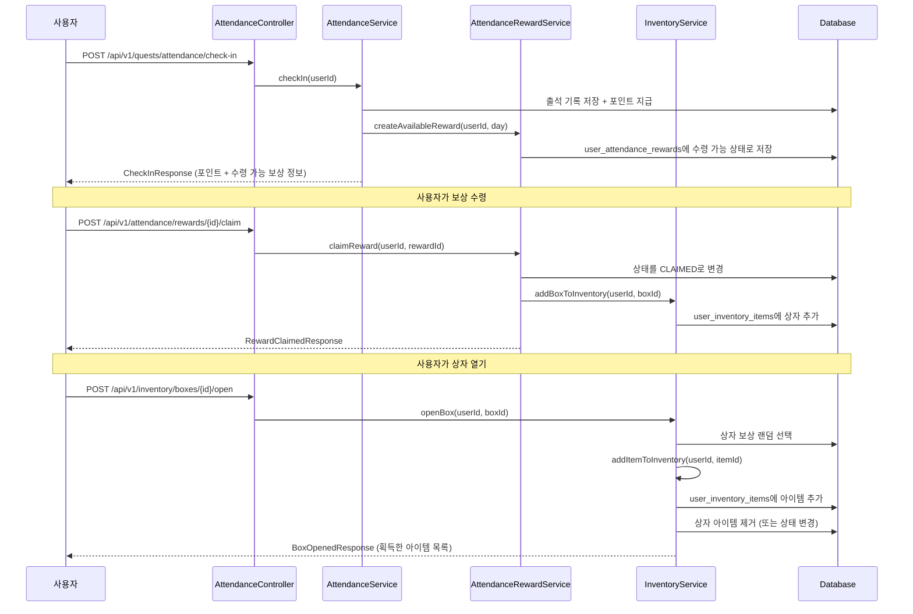

# 출석 보상 시스템 설계안

## 1. 시스템 개요

출석 체크인 시 포인트와 함께 **아이템 상자** 또는 **만근 대보상**을 수령 가능 상태로 만들고, 사용자가 수령 후 인벤토리에서 상자를 열어 아이템을 획득하는 2단계 보상 시스템입니다.

### 흐름도



## 2. 데이터베이스 스키마

### 2.1 출석 보상 마스터 테이블

**`attendance_rewards`** - 월별 출석 보상 정의 (Day 1~26)

```sql
CREATE TABLE IF NOT EXISTS attendance_rewards (
    id BIGSERIAL PRIMARY KEY,
    day_number INTEGER NOT NULL, -- 1~26
    reward_type VARCHAR(20) NOT NULL, -- POINTS, ITEM_BOX, PERFECT_ATTENDANCE
    points_amount INTEGER DEFAULT 0, -- 포인트 보상 (있을 경우)
    box_id BIGINT REFERENCES item_boxes(id), -- 아이템 상자 ID (있을 경우)
    is_perfect_attendance BOOLEAN DEFAULT FALSE, -- 만근 대보상 여부
    active BOOLEAN DEFAULT TRUE,
    created_at TIMESTAMP DEFAULT CURRENT_TIMESTAMP,
    updated_at TIMESTAMP DEFAULT CURRENT_TIMESTAMP,
    UNIQUE(day_number, reward_type)
);
```

### 2.2 사용자 출석 보상 수령 테이블

**`user_attendance_rewards`** - 사용자별 출석 보상 수령 상태

```sql
CREATE TABLE IF NOT EXISTS user_attendance_rewards (
    id BIGSERIAL PRIMARY KEY,
    user_id BIGINT NOT NULL REFERENCES users(id) ON DELETE CASCADE,
    attendance_reward_id BIGINT NOT NULL REFERENCES attendance_rewards(id),
    attendance_record_id BIGINT REFERENCES attendance_records(id), -- 어떤 출석에서 받았는지
    year INTEGER NOT NULL, -- 2026
    month INTEGER NOT NULL, -- 1~12
    status VARCHAR(20) NOT NULL DEFAULT 'AVAILABLE', -- AVAILABLE, CLAIMED, EXPIRED
    claimed_at TIMESTAMP,
    created_at TIMESTAMP DEFAULT CURRENT_TIMESTAMP,
    updated_at TIMESTAMP DEFAULT CURRENT_TIMESTAMP,
    UNIQUE(user_id, attendance_reward_id, year, month)
);
CREATE INDEX IF NOT EXISTS idx_user_att_rewards_user_status ON user_attendance_rewards(user_id, status);
```

### 2.3 아이템 상자 마스터 테이블

**`item_boxes`** - 아이템 상자 정의 (일반/고급/희귀/전설/특별)

```sql
CREATE TABLE IF NOT EXISTS item_boxes (
    id BIGSERIAL PRIMARY KEY,
    name VARCHAR(100) NOT NULL, -- "일반 아이템 상자", "고급 아이템 상자" 등
    box_type VARCHAR(20) NOT NULL, -- NORMAL, RARE, EPIC, LEGENDARY, SPECIAL
    description VARCHAR(500),
    image_url VARCHAR(500),
    active BOOLEAN DEFAULT TRUE,
    created_at TIMESTAMP DEFAULT CURRENT_TIMESTAMP,
    updated_at TIMESTAMP DEFAULT CURRENT_TIMESTAMP
);
```

### 2.4 상자 보상 정의 테이블

**`box_rewards`** - 각 상자에서 나올 수 있는 보상 풀 정의

```sql
CREATE TABLE IF NOT EXISTS box_rewards (
    id BIGSERIAL PRIMARY KEY,
    box_id BIGINT NOT NULL REFERENCES item_boxes(id) ON DELETE CASCADE,
    item_id VARCHAR(50) NOT NULL, -- 아이템 ID (프론트엔드 itemsData와 매칭)
    weight INTEGER NOT NULL DEFAULT 100, -- 가중치 (랜덤 확률)
    min_quantity INTEGER DEFAULT 1, -- 최소 수량
    max_quantity INTEGER DEFAULT 1, -- 최대 수량
    created_at TIMESTAMP DEFAULT CURRENT_TIMESTAMP
);
CREATE INDEX IF NOT EXISTS idx_box_rewards_box_id ON box_rewards(box_id);
```

### 2.5 사용자 인벤토리 테이블

**`user_inventory_items`** - 사용자 보유 아이템/상자

```sql
CREATE TABLE IF NOT EXISTS user_inventory_items (
    id BIGSERIAL PRIMARY KEY,
    user_id BIGINT NOT NULL REFERENCES users(id) ON DELETE CASCADE,
    item_id VARCHAR(50) NOT NULL, -- 아이템 ID 또는 상자 ID
    item_type VARCHAR(20) NOT NULL, -- ITEM, BOX
    quantity INTEGER NOT NULL DEFAULT 1,
    source VARCHAR(50), -- 출석, 퀘스트, 구매 등
    source_id BIGINT, -- 출석 보상 ID 등 (참조)
    obtained_at TIMESTAMP DEFAULT CURRENT_TIMESTAMP,
    created_at TIMESTAMP DEFAULT CURRENT_TIMESTAMP,
    updated_at TIMESTAMP DEFAULT CURRENT_TIMESTAMP
);
CREATE INDEX IF NOT EXISTS idx_user_inv_user_type ON user_inventory_items(user_id, item_type);
CREATE INDEX IF NOT EXISTS idx_user_inv_user_item ON user_inventory_items(user_id, item_id);
```

## 3. 엔티티 설계

### 3.1 AttendanceReward (출석 보상 마스터)

**파일**: `src/main/java/com/jinsung/safety_road_inclass/domain/attendance/entity/AttendanceReward.java`

```java
@Entity
@Table(name = "attendance_rewards")
public class AttendanceReward extends BaseTimeEntity {
    @Id @GeneratedValue(strategy = GenerationType.IDENTITY)
    private Long id;
    
    @Column(name = "day_number", nullable = false)
    private Integer dayNumber; // 1~26
    
    @Enumerated(EnumType.STRING)
    @Column(name = "reward_type", nullable = false)
    private AttendanceRewardType rewardType; // POINTS, ITEM_BOX, PERFECT_ATTENDANCE
    
    @Column(name = "points_amount")
    private Integer pointsAmount;
    
    @ManyToOne(fetch = FetchType.LAZY)
    @JoinColumn(name = "box_id")
    private ItemBox box;
    
    @Column(name = "is_perfect_attendance")
    private Boolean isPerfectAttendance = false;
    
    private Boolean active = true;
}
```

### 3.2 UserAttendanceReward (사용자 출석 보상 수령)

**파일**: `src/main/java/com/jinsung/safety_road_inclass/domain/attendance/entity/UserAttendanceReward.java`

```java
@Entity
@Table(name = "user_attendance_rewards")
public class UserAttendanceReward extends BaseTimeEntity {
    @Id @GeneratedValue(strategy = GenerationType.IDENTITY)
    private Long id;
    
    @ManyToOne(fetch = FetchType.LAZY)
    @JoinColumn(name = "user_id", nullable = false)
    private User user;
    
    @ManyToOne(fetch = FetchType.LAZY)
    @JoinColumn(name = "attendance_reward_id", nullable = false)
    private AttendanceReward attendanceReward;
    
    @ManyToOne(fetch = FetchType.LAZY)
    @JoinColumn(name = "attendance_record_id")
    private AttendanceRecord attendanceRecord;
    
    @Column(nullable = false)
    private Integer year;
    
    @Column(nullable = false)
    private Integer month;
    
    @Enumerated(EnumType.STRING)
    @Column(nullable = false)
    private RewardStatus status = RewardStatus.AVAILABLE; // AVAILABLE, CLAIMED, EXPIRED
    
    @Column(name = "claimed_at")
    private LocalDateTime claimedAt;
}
```

### 3.3 ItemBox (아이템 상자)

**파일**: `src/main/java/com/jinsung/safety_road_inclass/domain/inventory/entity/ItemBox.java`

```java
@Entity
@Table(name = "item_boxes")
public class ItemBox extends BaseTimeEntity {
    @Id @GeneratedValue(strategy = GenerationType.IDENTITY)
    private Long id;
    
    @Column(nullable = false, length = 100)
    private String name;
    
    @Enumerated(EnumType.STRING)
    @Column(name = "box_type", nullable = false)
    private BoxType boxType; // NORMAL, RARE, EPIC, LEGENDARY, SPECIAL
    
    @Column(length = 500)
    private String description;
    
    @Column(name = "image_url", length = 500)
    private String imageUrl;
    
    private Boolean active = true;
    
    @OneToMany(mappedBy = "box", cascade = CascadeType.ALL)
    private List<BoxReward> rewards = new ArrayList<>();
}
```

### 3.4 UserInventoryItem (사용자 인벤토리)

**파일**: `src/main/java/com/jinsung/safety_road_inclass/domain/inventory/entity/UserInventoryItem.java`

```java
@Entity
@Table(name = "user_inventory_items")
public class UserInventoryItem extends BaseTimeEntity {
    @Id @GeneratedValue(strategy = GenerationType.IDENTITY)
    private Long id;
    
    @ManyToOne(fetch = FetchType.LAZY)
    @JoinColumn(name = "user_id", nullable = false)
    private User user;
    
    @Column(name = "item_id", nullable = false, length = 50)
    private String itemId; // 아이템 ID 또는 상자 ID
    
    @Enumerated(EnumType.STRING)
    @Column(name = "item_type", nullable = false)
    private InventoryItemType itemType; // ITEM, BOX
    
    @Column(nullable = false)
    private Integer quantity = 1;
    
    @Column(length = 50)
    private String source; // 출석, 퀘스트, 구매 등
    
    @Column(name = "source_id")
    private Long sourceId;
    
    @Column(name = "obtained_at")
    private LocalDateTime obtainedAt;
}
```

## 4. 서비스 로직 설계

### 4.1 AttendanceService 수정

**파일**: `src/main/java/com/jinsung/safety_road_inclass/domain/attendance/service/AttendanceService.java`

**변경 사항**:
- `checkIn()` 메서드에서 포인트 지급 후, 해당 일차의 보상이 있으면 `AttendanceRewardService.createAvailableReward()` 호출

```java
@Transactional
public CheckInResponse checkIn(Long userId) {
    // ... 기존 포인트 지급 로직 ...
    
    // 출석 보상 수령 가능 상태로 생성
    int dayOfMonth = today.getDayOfMonth(); // 1~31
    int attendanceCount = getAttendanceCountThisMonth(userId, today);
    
    if (attendanceCount <= 26) { // 26일 이내만 보상 지급
        attendanceRewardService.createAvailableReward(userId, attendanceCount, today);
    }
    
    return CheckInResponse.builder()
        .checkInDate(today)
        .pointsEarned(points)
        .currentStreak(userStreak.getCurrentStreak())
        .availableRewards(availableRewards) // 수령 가능한 보상 목록
        .build();
}
```

### 4.2 AttendanceRewardService (신규)

**파일**: `src/main/java/com/jinsung/safety_road_inclass/domain/attendance/service/AttendanceRewardService.java`

**주요 메서드**:
- `createAvailableReward(Long userId, int day, LocalDate checkInDate)`: 출석 보상 수령 가능 상태 생성
- `claimReward(Long userId, Long rewardId)`: 보상 수령 처리 (인벤토리에 추가)
- `getAvailableRewards(Long userId, int year, int month)`: 수령 가능한 보상 목록 조회

### 4.3 InventoryService (신규)

**파일**: `src/main/java/com/jinsung/safety_road_inclass/domain/inventory/service/InventoryService.java`

**주요 메서드**:
- `addBoxToInventory(Long userId, Long boxId, String source, Long sourceId)`: 상자를 인벤토리에 추가
- `addItemToInventory(Long userId, String itemId, int quantity, String source)`: 아이템을 인벤토리에 추가
- `openBox(Long userId, Long inventoryItemId)`: 상자 열기 (랜덤 보상 지급)
- `getInventory(Long userId, InventoryItemType type)`: 인벤토리 조회

## 5. API 엔드포인트 설계

### 5.1 출석 보상 수령 API

**파일**: `src/main/java/com/jinsung/safety_road_inclass/domain/attendance/controller/AttendanceRewardController.java`

```java
@RestController
@RequestMapping("/api/v1/attendance/rewards")
public class AttendanceRewardController {
    
    // 수령 가능한 보상 목록 조회
    @GetMapping("/available")
    public ApiResponse<List<AvailableRewardResponse>> getAvailableRewards(
        @AuthenticationPrincipal CustomUserPrincipal principal,
        @RequestParam int year,
        @RequestParam int month
    );
    
    // 보상 수령
    @PostMapping("/{rewardId}/claim")
    public ApiResponse<RewardClaimedResponse> claimReward(
        @AuthenticationPrincipal CustomUserPrincipal principal,
        @PathVariable Long rewardId
    );
}
```

### 5.2 인벤토리 API

**파일**: `src/main/java/com/jinsung/safety_road_inclass/domain/inventory/controller/InventoryController.java`

```java
@RestController
@RequestMapping("/api/v1/inventory")
public class InventoryController {
    
    // 인벤토리 조회
    @GetMapping
    public ApiResponse<InventoryResponse> getInventory(
        @AuthenticationPrincipal CustomUserPrincipal principal,
        @RequestParam(required = false) InventoryItemType type
    );
    
    // 상자 열기
    @PostMapping("/boxes/{inventoryItemId}/open")
    public ApiResponse<BoxOpenedResponse> openBox(
        @AuthenticationPrincipal CustomUserPrincipal principal,
        @PathVariable Long inventoryItemId
    );
}
```

## 6. 구현 순서

1. **데이터베이스 스키마 생성**
   - `sql/V3__attendance_rewards_system.sql` 파일 생성
   - 5개 테이블 생성 및 인덱스 추가

2. **엔티티 클래스 생성**
   - `AttendanceReward`, `UserAttendanceReward`, `ItemBox`, `BoxReward`, `UserInventoryItem`
   - Enum 클래스: `AttendanceRewardType`, `RewardStatus`, `BoxType`, `InventoryItemType`

3. **Repository 인터페이스 생성**
   - `AttendanceRewardRepository`, `UserAttendanceRewardRepository`
   - `ItemBoxRepository`, `BoxRewardRepository`, `UserInventoryItemRepository`

4. **서비스 로직 구현**
   - `AttendanceRewardService` 구현
   - `InventoryService` 구현
   - `AttendanceService.checkIn()` 수정

5. **DTO 클래스 생성**
   - `AvailableRewardResponse`, `RewardClaimedResponse`
   - `InventoryResponse`, `BoxOpenedResponse`

6. **컨트롤러 구현**
   - `AttendanceRewardController` 구현
   - `InventoryController` 구현

7. **초기 데이터 시딩**
   - `attendance_rewards` 테이블에 Day 1~26 보상 정의
   - `item_boxes` 테이블에 상자 타입별 정의
   - `box_rewards` 테이블에 각 상자의 보상 풀 정의

## 7. 주요 고려사항

- **월별 리셋**: 매월 1일 자정에 `user_attendance_rewards`의 미수령 보상은 `EXPIRED` 상태로 변경 (선택사항)
- **랜덤 보상**: `BoxReward`의 `weight` 필드를 사용한 가중치 기반 랜덤 선택
- **중복 수령 방지**: `user_attendance_rewards`의 UNIQUE 제약조건으로 동일 월/일차 중복 수령 방지
- **트랜잭션**: 보상 수령 및 상자 열기는 모두 `@Transactional`로 처리하여 데이터 일관성 보장
